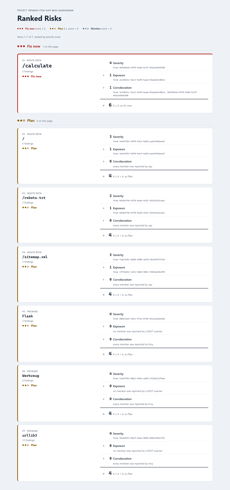

# Verion

**From security findings to security decisions.**

Verion is a developer-first AppSec platform that unifies signals from existing security tools — SAST, SCA, secrets, DAST — understands the context of the application being protected, correlates evidence across sources, and turns raw findings into prioritized, explainable, and verifiable remediation decisions.

> **Status:** in development — M0–M7 complete (M5.7, a CI job split, moved to M11), M8 (Dashboard & History) in progress — M7.2 ships Brief generation: `POST /projects/{id}/briefs` narrates one current scored Risk, selected by its exact finding ids, through M7.1's OpenAI adapter and stores the result; `GET /projects/{id}/briefs` pages the stored Briefs. M7.3 adds each Brief's *what happened*, narrated by a separate call from members' sanitized typed titles and locations, so the call that narrates priority still sees nothing scanned, and it takes the capture that was owed: a 200 per prompt and a redacted 401 from the real API are committed and replayed by the adapter's own tests, which ends the M7.1 departure. All three of M7's issues are done and its boundary review has closed it: a Brief carries three of FR-8's four parts, confidence is M8.5, and recommended action and estimated effort are cut to V2. **The pipeline runs end to end and its output is now readable over HTTP.** A scan starts from a signed GitHub push webhook or, since M8.8, when the project's owner calls `POST /projects/{id}/scans`; `GET /projects/{id}/scans/{scan_id}` reports the scan's status. It fans out to Semgrep, Trivy and OWASP ZAP concurrently, persists each tool's raw output, and records in the same transaction that normalization is owed; a separate worker job then turns the trustworthy output into `Finding` rows and records one sighting per scan that observes each one. A finding is durable and project-scoped, deduplicated on a content hash, so re-running a scan refreshes rows rather than duplicating them — and a reconciliation sweep guarantees no scan's normalization is lost even if the queue drops the message. `GET /projects/{id}/findings` returns a project's findings most-severe-first with each one's sighting history, and says whether normalization actually completed, so a short list caused by a failed pipeline stage is distinguishable from a clean project. Raw tool output is a separate, per-finding route rather than a field on the listing, because it is a verbatim copy of scanned source. `GET /projects/{id}/risks` groups a project's findings into candidate Risks on shared signals, and for a Flask project whose owner has declared that the scanned URL serves the connected repository, a Semgrep finding and a ZAP finding on the same route land in one group. `GET /projects/{id}/scored-risks` returns the same groups ranked, each carrying the signals that produced its priority, computed per request and persisting nothing; it carries no confidence yet. A first two-page frontend (M8.3, started early) signs in and renders that ranked list with each priority's working shown. The dashboard follows. See the roadmap below.



*The ranked Risk list for a replayed real scan of `verion-demo-target`, reproducible with [Run the demo screen](#run-the-demo-screen). Also: [dark mode](docs/screenshots/ranked-risks-dark.png), [sign-in](docs/screenshots/sign-in.png), [a project with nothing normalized yet](docs/screenshots/empty-state.png).*

---

## The problem

Modern AppSec tooling is excellent at detecting issues and increasingly good at generating individual fixes. It's still weak at the layer in between: helping a developer understand, out of 100+ findings from several disconnected tools, **which 3 things actually matter today, why, and what to do about them.**

Verion doesn't compete with scanners — it sits on top of them.

```
Semgrep, Trivy, ZAP findings
            │
            ▼
  Normalization → Correlation → Risk scoring → Explanation
            │
            ▼
      A ranked, evidence-backed Security Brief
```

## Core differentiators

- **Decision-oriented, not detection-oriented** — surfaces the few things that matter instead of a wall of findings.
- **Evidence-backed correlation** — related findings across tools (e.g. SAST + DAST on the same endpoint) are grouped into one traceable risk.
- **Explainable scoring** — every priority is a traceable function of severity, exposure and cross-tool corroboration, never an opaque number.
- **Stack-aware context** — recommendations account for the actual framework, deployment, and data sensitivity of the project being scanned.

## Architecture

Verion is built as a **modular monolith using Hexagonal Architecture (Ports & Adapters)**: each module (identity, projects, scanning, normalization, correlation, risk engine, brief, history) keeps its domain logic free of framework and infrastructure dependencies, with scanners, storage, and the LLM explanation layer plugged in as swappable adapters.

Full design and rationale: [`docs/ARCHITECTURE.md`](docs/ARCHITECTURE.md)

## Tech stack

| Layer | Choice |
|---|---|
| API | FastAPI |
| Frontend | Next.js |
| Database | PostgreSQL |
| Queue / cache | Redis |
| SAST | Semgrep |
| SCA / container | Trivy |
| DAST | OWASP ZAP (Automation Framework) |
| VCS | GitHub API / GitHub Actions |
| Containerization | Docker / docker-compose |

## Documentation

| Document | Contents |
|---|---|
| [`docs/PRODUCT_SPEC.md`](docs/PRODUCT_SPEC.md) | Vision, personas, functional requirements, MVP/V2 scope |
| [`docs/ARCHITECTURE.md`](docs/ARCHITECTURE.md) | Hexagonal architecture, module boundaries, domain model, sequence diagrams |
| [`docs/ROADMAP.md`](docs/ROADMAP.md) | 16-week plan, milestones, issue-level breakdown |
| [`docs/adr/`](docs/adr) | Architecture decision records |
| [`CLAUDE.md`](CLAUDE.md) | Project conventions and non-negotiable rules for AI-assisted development |

## Roadmap status

Building in 16 weeks across 12 milestones — see [`docs/ROADMAP.md`](docs/ROADMAP.md) for the full breakdown.

- [X] M0 — Foundations
- [X] M1 — Identity & Projects
- [X] M2 — Security Context
- [X] M3 — Scanning Infrastructure
- [X] M4 — Normalization
- [x] M5 — Correlation Engine
- [x] M6 — Risk / Decision Engine
- [x] M7 — Security Brief / Explanation Layer
- [ ] M8 — Dashboard & History
- [ ] M9 — Verification Loop
- [ ] M10 — Security Hardening
- [ ] M11 — Testing, Docs, Deployment

## Getting started

The API and the background worker both run. Postgres and Redis come from `docker-compose`; Semgrep and Trivy need to be on `PATH` and ZAP runs as a Docker container, so a scan needs Docker available.

```bash
# install uv (https://docs.astral.sh/uv/) if you don't have it
pip install uv

# install dependencies + create the local virtualenv
uv sync

# enable pre-commit hooks (ruff lint + format on every commit).
# these run the ruff from the venv above — the same version CI runs. `uv run`
# creates that venv on demand, so a commit works even without the step above;
# doing it first just means the first commit isn't paying for the install.
uv run pre-commit install

# start local Postgres + Redis
docker compose -f infra/docker-compose.yml up -d

# apply migrations
uv run alembic upgrade head

# run the API
uv run uvicorn verion.platform.app:app --reload

# in a second terminal: run the worker that executes scans
uv run arq verion.platform.worker.WorkerSettings
```

## Run the demo screen

Here rather than in `docs/`, because the screenshot at the top of this file is what a reader will want to reproduce, and these steps extend *Getting started* above.

The screen needs a project that has been scanned, normalized and correlated. [`scripts/seed_demo_project.py`](scripts/seed_demo_project.py) builds one by replaying a committed real scan of `verion-demo-target` through the real pipeline. Its docstring says which parts are real and which are replaced, and states the demo credentials. Node 20.9 or later is needed for the frontend.

```bash
# start local Postgres + Redis, and apply migrations
docker compose -f infra/docker-compose.yml up -d
uv run alembic upgrade head

# seed the demo project; prints the demo credentials and the new project's id
uv run python scripts/seed_demo_project.py

# terminal 1: run the API
uv run uvicorn verion.platform.app:app --reload

# terminal 2: run the frontend (npm ci installs the pinned, committed lockfile)
cd frontend
npm ci
npm run dev
```

Open <http://localhost:3000>, sign in with the credentials the seed script printed, and paste the project id it printed. No route lists a user's projects yet, so the id has to be pasted.

> **Running the tests deletes the demo data.** `tests/integration/conftest.py`'s `_clean_all_tables` fixture is `autouse`: after every integration test, it deletes every row of every table registered on `Base.metadata`. The test engine is created from the same `Settings.database_url` the app uses. A plain `uv run pytest` runs the integration tests, so re-run the seed script after it.

## License

MIT.
