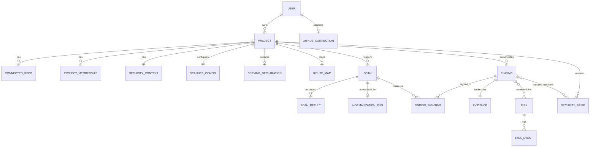

# Verion — Architecture

**Status:** Draft v1.0
**Related:** `PRODUCT_SPEC.md`
**Last updated:** 2026-09-19

---

## 1. Purpose

This document defines how Verion is structured internally: architectural style, module boundaries, the domain model, and how data flows through the scan → correlation → risk → brief pipeline described in `PRODUCT_SPEC.md`.

The goal is not just "a working backend" but a codebase that reads as a **deliberately engineered system** — clear boundaries, explicit dependencies, and decisions that are documented rather than accidental. This matters both for the product's own credibility (a security tool with a sloppy architecture undermines its own pitch) and for what it demonstrates.

---

## 2. Architectural Style: Hexagonal Architecture in a Modular Monolith

Verion uses **Hexagonal Architecture (Ports & Adapters)** at the module level, deployed as a **single modular monolith** (no microservices — see ADR-001).

### 2.1 Why hexagonal architecture fits this product specifically

This isn't architecture for architecture's sake — it maps directly onto Verion's core requirement from the product spec: **every scanner is a replaceable, normalized input; every recommendation must be explainable and traceable.**

- Section 7 of `PRODUCT_SPEC.md` (Non-Functional Requirements → Extensibility) requires that adding a new scanner "should only require a new adapter, not changes to correlation/risk logic." That is, by definition, a **Port** (the contract: `ScannerPort`) with multiple **Adapters** (`SemgrepAdapter`, `TrivyAdapter`, `ZapAdapter`, future ones).
- The Risk/Decision Engine must stay explainable and testable in isolation, with no dependency on FastAPI, PostgreSQL, or any specific scanner's output format. Hexagonal architecture enforces that isolation structurally, not just by convention.
- The AI Explanation Layer (used to generate the Security Brief) is itself swappable — it sits behind a port (`ExplanationProviderPort`) so the LLM provider is an implementation detail, not baked into domain logic.

### 2.2 The Dependency Rule

```
                     ┌─────────────────────────┐
                     │      Inbound Adapters     │
                     │  (REST API, GitHub        │
                     │   webhooks, CLI, CI hook)  │
                     └────────────┬───────────────┘
                                  │ implements calls to
                                  ▼
                     ┌─────────────────────────┐
                     │      Inbound Ports        │
                     │  (Use Case interfaces)    │
                     └────────────┬───────────────┘
                                  ▼
              ┌───────────────────────────────────────┐
              │           Application Layer            │
              │   (Use Cases / Services orchestrate     │
              │    the Domain — no framework code here) │
              └────────────┬────────────────────────────┘
                            ▼
              ┌───────────────────────────────────────┐
              │               Domain                    │
              │  Entities, Value Objects, Domain          │
              │  Services — pure business logic,          │
              │  zero external dependencies                │
              └────────────┬────────────────────────────┘
                            ▲
                            │ implements
                     ┌─────────────────────────┐
                     │      Outbound Ports        │
                     │  (Repository, Scanner,     │
                     │   Explanation, VCS, Queue)  │
                     └────────────┬───────────────┘
                                  ▲ implements
                     ┌─────────────────────────┐
                     │     Outbound Adapters      │
                     │ (Postgres repos, Redis,    │
                     │  Semgrep/Trivy/ZAP CLI,     │
                     │  GitHub API, LLM provider)  │
                     └─────────────────────────┘
```

**Rule:** dependencies always point inward. Domain knows nothing about FastAPI, SQLAlchemy, Redis, or any scanner's CLI output. The Application layer orchestrates Domain logic through ports; it does not know which adapter is behind a port at compile time.

---

## 3. Module Boundaries

Rather than one giant hexagon, Verion is split into cohesive **modules**, each with its own domain/application/ports, sharing infrastructure adapters where sensible. This is what makes the monolith "modular" rather than a ball of mud.

| Module | Responsibility |
|---|---|
| **Identity** | Users, auth, RBAC, project membership |
| **Projects** | Projects, connected repositories, Security Context |
| **Scanning** | Triggering scans, orchestrating scanner adapters, ingesting raw output |
| **Normalization** | Converting raw scanner output into the common `Finding` schema, deduplication |
| **Correlation** | Grouping related Findings into candidate Risks |
| **RiskEngine** | Scoring and prioritizing Risk (severity, exposure, corroboration) |
| **Brief** | Generating the Security Brief via the AI Explanation Layer, evidence linking |
| **History** | Scan history, risk lifecycle (open/dismissed/resolved), audit log *(2026-09-19, ADR-0036: M8.1 built dismissal and its undo, as an append-only event log. Resolution is M9.1's, and there is no "open" event: a Risk is open when no active dismissal covers it.)* |

Each module exposes its own inbound ports (use cases other modules or the API layer can call) and depends on other modules **only through their ports**, never their internals — e.g., `Correlation` depends on `Normalization`'s `FindingRepositoryPort`, never on its ORM models directly.

---

## 4. Domain Model

### 4.1 Core entities

```
User
 ├── id, email, hashed_password, created_at
 └── (authentication only — no role here; see ProjectMembership below)

GitHubConnection   # M1.5a
 ├── user_id   # natural key, no separate id — one connection per user (MVP)
 ├── access_token   # plaintext; encryption at rest deferred to M10, see GitHubConnectionModel
 ├── github_username
 └── connected_at

Project
 ├── id, owner_id, name, created_at
 ├── connected_repos: [ConnectedRepo]
 └── security_context: SecurityContext

ProjectMembership   # M1.3
 ├── project_id, user_id   # composite natural key, no separate id
 └── role (owner|member)   # per PRODUCT_SPEC.md FR-1: RBAC is project-scoped, not identity-scoped

ServingDeclaration   # M5.5, ADR-0028 — one per project
 ├── id, project_id
 ├── declared_target_url, declared_repo_url, declared_default_branch   # both sides BY VALUE
 └── declared_at, declared_by
 #  Whether it is still in force is derived at read time by
 #  projects/domain/serving_declaration.declaration_in_force, never stored.

RouteMapRecord   # M5.6 commit 4 — projects; one per project (ADR-0029)
 ├── id, project_id, framework
 ├── source_archive_commit_sha   # the route map's tree only (G56)
 ├── derived_at
 └── route_map: RouteMap         # routes with their spans, plus what was not mapped and why

ConnectedRepo   # named to avoid colliding with the *RepositoryPort persistence-pattern suffix (M1.3)
 ├── id, project_id, provider (github), url, default_branch

SecurityContext
 ├── id, project_id
 ├── language, framework, database
 ├── deployment_target, ci_provider
 ├── exposure_tags: [public_facing, handles_pii, ...]  (user-confirmed)

ScannerConfig   # M3.7 — projects; operational config, deliberately not on SecurityContext
 ├── id, project_id   # UNIQUE — one row per project
 ├── enabled_tools: [ScannerTool]   # absent row = never configured (default); [] = run nothing
 ├── zap_target_url   # nullable; tool-specific, accepted as debt (ADR-016 decision 3, G2)
 ├── updated_at
 ├── active_scan_consent_target   # M5.4 — the zap_target_url consent was granted against
 ├── active_scan_consent_granted_at
 └── active_scan_consent_granted_by   # all three set = granted; in force only while
                                      # active_scan_consent_target == zap_target_url
                                      # (ADR-0024 decisions 1 and 3)

Scan
 ├── id, project_id, triggered_by, status, started_at, finished_at
 ├── failure_reason   # M3.3; a failure BEFORE any tool ran — never a per-tool failure
 └── raw_results: [ScanResult]   # one per tool that ran
 # status is a DERIVED, human-facing summary of the per-tool outcomes below
 # (completed|partial|failed). No pipeline stage is ever added to it, and no
 # pipeline reads it — M4 reads ScanResultRepositoryPort.get_succeeded_by_scan_id.
 # See ADR-016 decision 2 and ADR-0017 decision 1.

ScanResult   # M3.7 — one row per tool that was attempted, including one that failed
 ├── id, scan_id, tool   # UNIQUE(scan_id, tool) — the upsert key that keeps retries idempotent
 ├── status (succeeded|failed)
 ├── raw_output      # nullable; non-null iff succeeded, enforced by a CHECK constraint
 └── failure_reason  # nullable; non-null iff failed

NormalizationRun   # M4.0 — normalization; pipeline progress, one row per Scan
 ├── id, scan_id   # UNIQUE — the idempotency key; the row IS the scan→normalize outbox
 ├── project_id    # M4.3 — the dedup scope, which normalization can reach no other way:
 │                 # the sweep selects on this table alone (ADR-0017 decision 2), so a read
 │                 # port back into scanning could not supply it. No FK, like scan_id.
 │                 # Written by RunScanUseCase through the primitives-only port, which
 │                 # gained the parameter here (ADR-0019 decision 7, ADR-0017 Amendments).
 ├── status (pending|running|completed|failed)
 ├── requested_at, started_at, finished_at
 └── failure_reason   # nullable; non-null iff failed. Never Scan.failure_reason.
 # Written by RunScanUseCase in the same transaction as the ScanResult rows.
 # Exists iff ScanResult rows were persisted. See ADR-0017.

Finding   # M4.1 — normalization; produced by the per-scanner mappers
 ├── id, project_id                     # DURABLE and project-scoped, NOT scan-scoped
 ├── dedup_hash                         # derived property, never assigned: "v1:<sha256>"
 ├── source: ScannerTool                # shared_kernel/scanner_tools.py — not a literal set
 ├── rule_id                            # the tool's own identifier for WHAT fired:
 │                                      # check_id / VulnerabilityID / alertRef
 ├── severity: Severity                 # shared_kernel/severity.py — the normalized scale
 ├── native_severity                    # what the tool literally said ("ERROR", "CRITICAL", "Low")
 ├── title
 ├── cwe, owasp_category, cvss          # nullable; None means the tool supplied nothing
 ├── location: Location, evidence: Evidence
 # A Finding OUTLIVES the scan that produced it (ADR-0019, resolving G5): FR-5 requires
 # dedup across repeated scans, and one scan_id could only ever mean "first" or "latest".
 # Per-scan observation is FindingSighting below. Deliberately NO last_seen_at /
 # last_seen_scan_id: both are max() over sightings, and a denormalized copy would put a
 # summary that can silently go stale into M9.1's path (ADR-016 decision 2's objection).
 # dedup_hash is over source + rule_id + file_path + package + url + http_method +
 # parameter, and NOT over lines, installed_version, severity, cvss, cwe or title — those
 # change without the finding changing, and re-keying on them fabricates resolution events.
 # severity collapses three incompatible tool scales into one, so it is lossy for
 # ORDERING; native_severity is what keeps it lossless for PROVENANCE (FR-9).
 # A field with no source is None — never "" and never a guess, or a mapper would
 # be inventing a Risk Engine input (rule 5). See ADR-0018.
 # NOT here yet:
 #   confidence  — M6.1. Only ZAP supplies it, as an opaque numeric code whose
 #                 vocabulary mixes degrees with states (Confirmed/False Positive),
 #                 and RiskReasoning's five signals do not include it.

FindingSighting   # M4.2 — normalization; one scan's observation of one Finding
 ├── finding_id, scan_id   # composite natural key, no surrogate id (ProjectMembership's shape)
 ├── observed_at
 └── match_count           # source elements that collapsed into this identity in this scan
 # ABSENCE is the point: "not sighted in scan N" is the absence of a row, and "scan N was
 # never normalized" is NormalizationRun — which exists iff ScanResult rows were persisted.
 # The two compose into the distinction M9.1 needs, with no third state.
 # M9.1 CONSTRAINT: "not sighted in the latest scan" only means resolved for the tools that
 # SUCCEEDED in that scan. A failed Trivy makes a scan PARTIAL and contributes no SCA
 # findings; a naive absence check would silently resolve every dependency finding.
 # get_succeeded_by_scan_id already draws that line. See ADR-0019's Consequences.
 # Written by the normalization use case (M4.4), never by a mapper: identity is the hash
 # and id is a surrogate, so only the upsert on (project_id, dedup_hash) settles which wins.

Location   # M4.1 — an EMBEDDED value object on Finding, not an entity: no id, no
           # table of its own, and deliberately absent from the §4.2 ERD. One flat
           # shape, not a tagged union of three.
 ├── file_path, start_line, end_line          # Semgrep
 ├── package, installed_version               # Trivy
 └── url, http_method, parameter              # ZAP
 # All nullable, and an all-None Location is valid (a ZAP site-level alert can
 # carry no instances). A tagged union would force downstream readers to branch on
 # which tool produced the finding — per-tool knowledge past normalization, which
 # is the leak the common schema exists to prevent.

Evidence
 ├── id, finding_id, scan_id, raw_payload, source_tool: ScannerTool, captured_at
 # raw_payload is a verbatim COPY of the one source element (a Semgrep result, a
 # Trivy vulnerability, a ZAP alert narrowed to one instance), not a reference into
 # ScanResult.raw_output: that blob is replaceable by a retry's upsert, so a
 # reference would dangle silently. ADR-0018 decision 6, clarified by ADR-0019.
 # ONE row per Finding, holding the LATEST observation's payload — refreshed on every
 # sighting, unconditionally. FR-9 asks for the output that produced THIS assessment,
 # and deciding an older payload was "richer" would need per-tool comparison. scan_id
 # records which scan the retained payload came from; ScanResult.raw_output is the
 # floor for anything older. Per-sighting retention is M9.2's trigger.

MatchKey   # M5.8 — correlation; what two findings are compared on (ADR-0023)
 ├── project_id
 └── package, url   # url: ZAP's path since M5.6 commit 3; for a finding whose source line
                    # exactly one route serves, the derived route path — only while the
                    # project's serving declaration is in force (ADR-0029)

MatchGroup   # M5.8 — correlation; a candidate Risk as SHIPPED
 ├── key: MatchKey
 └── finding_ids
 # A projection, recomputed per request and never stored (ADR-0025 decision 1): no id, no
 # table, no repository. The Risk block below is the design for a scored, stored Risk;
 # nothing is forced to persist one before M8.1.

Risk   # designed, not built — see MatchGroup above (marked 2026-09-15)
 ├── id, project_id
 ├── findings: [Finding]         # correlated group
 ├── priority (fix_now|plan|monitor)
 ├── confidence, reasoning: RiskReasoning
 ├── status (open|dismissed|resolved)
 └── history: [RiskEvent]
 # 2026-09-19, ADR-0036 (M8.1): the first stored Risk is a DISMISSAL RECORD, not this block.
 # risks(id, project_id, finding_ids) is a snapshot of the surface's members, written once by a
 # dismissal. risk_events(id, risk_id, ordinal, kind dismissed|undismissed, actor_user_id,
 # reason, occurred_at) is append-only. There is no stored `status`: a current surface is
 # dismissed iff its finding-id set is a subset of a snapshot whose latest event is `dismissed`.
 # There is no `open` event. `resolved` is M9.1's.

RiskDismissal   # M8.1, built (ADR-0036): a `risks` row and its latest `risk_events` row
 ├── risk: Risk                # id, project_id, finding_ids (snapshot, as data; never refreshed)
 └── latest: RiskEvent         # highest ordinal: kind, actor_user_id, reason, occurred_at
 # The full log stays in risk_events; no type holds it, because no read returns it.

RiskReasoning
 ├── severity_signal, exposure_signal, reachability_signal
 ├── asset_sensitivity_signal, environment_signal
 └── explanation_text   # human-readable, generated but inspectable
 # M6.1 (ADR-0005), marked 2026-09-16: the SHIPPED signal set is severity_signal,
 # exposure_signal and a corroboration_signal this block does not name.
 # reachability_signal, asset_sensitivity_signal and environment_signal have NO SOURCE
 # in src/ and are declined for M6. exposure_signal is supplied by "a DAST member
 # exists", not by SecurityContext.exposure_tags, which is free text behind a
 # persistence port and unreadable after a second detect (G55).
 # A Risk scores a SURFACE — the package or route path its match key names — never
 # "the same vulnerability". The Risk's own `confidence` is NOT decided by ADR-0005:
 # the scale was cut by that issue's byte ceiling and deferred to M6.2 (G63).
 # M6.2 DECIDED it (2026-09-16): no confidence is emitted, and a test asserts the
 # absence. So a scored Risk carries a priority bucket and a reasoning and no
 # confidence, and M7.1 is where the scale gets chosen — by the consumer that
 # renders it. FR-7's second output is therefore unmet by shipped code; G63 and
 # ADR-0004's dated amendment both say so.
 # M7.1 (2026-09-17, ADR-0032 decision 3) did NOT choose it: either scale reaches a
 # third module, so the absence is recorded and G63 re-points to M7.2.
 #
 # SHIPPED at M6.2, in risk_engine/domain/scoring.py: `ScoredSurface` is the scored
 # projection above — project_id, the key's package/url, finding_ids, priority_score,
 # priority and reasoning, with NO id and NO row. The `Risk` block above stays
 # designed-not-built: this adds a function and a signal set, not a table.
 # `fix_now` has exactly one reachable route, so no package surface can reach it — G64.

SecurityBrief   # M7.2 — brief; SHIPPED (ADR-0033). Append-only: one row per generation
 ├── id, project_id
 ├── finding_ids                 # the Risk's members, held as DATA and never as an address:
 │                               # FR-9's link, and what a client joins on against /scored-risks
 ├── decision: ExplainableDecision   # what the narrator was shown, whole; stored as versioned
 │                                   # JSONB whose keys derive from dataclasses.fields
 ├── explanation: Explanation    # text (why it matters), model, prompt_version
 ├── what_happened: Explanation | None   # M7.3 (ADR-0034): a SECOND narration, from members'
 │                                       # typed titles and locations only, by a separate call;
 │                                       # None only for a Brief written before M7.3
 └── generated_at
 # Designed until 2026-09-17 as `id, risk_id, what_happened, why_it_matters,
 # recommended_action, estimated_effort, confidence, generated_at`. What changed:
 #  - risk_id: a Risk has no identifier (ADR-0025 decision 1), so a Brief has its own id and
 #    holds the member set instead. POST /projects/{id}/briefs selects the current surface by
 #    that exact set and fails closed when membership has changed.
 #  - what_happened, recommended_action: need scanned content, and nothing produces them (G74).
 #    (Until M7.3. what_happened now ships, from typed member fields (ADR-0034);
 #    recommended_action still has no producer.)
 #  - estimated_effort: no producer, and whether an LLM may ever supply one is undecided (G74).
 #  - confidence: none is emitted (G63).
 # Two of FR-8's six parts ship: why it matters, and evidence sources as finding ids.
 # (Three since M7.3: what happened joins them, ADR-0034.)
 # `brief/domain` importing `risk_engine.ports` is the first cross-module import from any
 # domain/ package, and no contract covers it (G77).
```

### 4.2 Entity relationship overview



---

## 5. Ports Catalog

### 5.1 Inbound ports (use cases — what the outside world can ask Verion to do)

| Port | Purpose |
|---|---|
| `RegisterUserUseCase` / `AuthenticateUserUseCase` | Identity module |
| `ConnectRepositoryUseCase` | Attach a GitHub repo to a project |
| `BuildSecurityContextUseCase` | Extract/refresh Security Context for a project |
| `TriggerScanUseCase` | Create a `Scan` and enqueue it — it does **not** orchestrate the pipeline. Takes one `authorized` flag its caller derives (ADR-0035 decision 3); the enqueue is sent after the request commits (decision 5) |
| `StartScanUseCase` | A user starts a scan: asks `ProjectAccessPort.may_manage_project` (owner-only) and hands the verdict to `TriggerScanUseCase`. Behind `POST /projects/{id}/scans` (M8.8, ADR-0035) |
| `GetScanUseCase` | One scan's status and `failure_reason`, for any member: read verdict first, then the scan must belong to the path's project. Behind `GET /projects/{id}/scans/{scan_id}` (M8.8, ADR-0035) |
| `RunScanUseCase` | The worker's entry point: run every enabled scanner, persist `ScanResult` rows, hand off to normalization |
| `NormalizeScanUseCase` | The normalization job's entry point: map a scan's *succeeded* raw output into `Finding` rows, collapse by identity, record one `FindingSighting` per identity, and transition the `NormalizationRun` (M4.4) |
| `SweepPendingNormalizationsUseCase` | The reconciliation backstop: re-enqueue normalization for runs that are owed and not progressing. Selects on `normalization_runs` alone, never `Scan.status` (M4.4) |
| `ListProjectFindingsUseCase` | A project's findings with each one's sighting aggregate, filtered and paged, plus the normalization state that says whether the list is complete. Project-scoped and scan-independent — it reports when a finding was last seen, never whether it is resolved (M4.5) |
| `GetFindingEvidenceUseCase` | One finding's verbatim tool output — FR-9's link, followed. The only route that returns scanned content, deliberately separate from the listing (M4.5, ADR-0022) |
| `CorrelateFindingsUseCase` | Group related `Finding`s into candidate Risks. **Its scope is a PROJECT's findings, not one scan's** — M5.8's criterion (a), decided 2026-08-26 in ADR-0023's `## Amendments` before any matching code, on four grounds: it is the scope `Finding` itself has (ADR-0019 decision 1), the scope M5.1's measured grouping has, the one whose alternative costs M9.1's four criteria rather than a `WHERE` clause, and the only one a completeness envelope exists for today. *(This clause said the scope was **M5.1's decision and deliberately not stated here** until 2026-08-25, then **M5.8's** until 2026-08-26. Rewritten inline and dated each time, on the precedent this row sets for itself in the next sentence. M5.1 closed without taking the decision and without building the use case — `ROADMAP.md` **G30**; M5.8 has now taken it, and the "M5.1" in the next sentence is left as written and reads M5.8 too. **That next sentence is now a counterfactual and stays anyway**, for the reason it was kept when the decision was still open: the cost it states is what makes the choice above reviewable — a reader who wants to overturn per-project scope needs to see what scan scoping would have cost, and deleting it would leave the decision asserted with its price removed.)* This row said "over a scan's findings" until the M4→M5 boundary review, which is a query `FindingRepositoryPort` deliberately does not offer: `scan_id` is not the leading column of the sightings primary key, and the scan-first read, its index, the absence check and the succeeded-tools caveat are M9.1's acceptance criteria, together. §8 drew the same stage as an unscoped `read Findings`, so the two sections disagreed and this one was the more specific. M5.1 choosing scan scoping means building M9.1's query first, not inheriting it. *(Since M5.6 commit 3, marked 2026-09-15: it reads `ServingDeclarationPort` and, only while a project's declaration is in force, `RouteMapPort`, to derive a route path for a finding whose source line exactly one route serves — ADR-0029.)* |
| `ListProjectRisksUseCase` | A page of a project's candidate Risks, plus the normalization state that says whether the list is complete. Composes `CorrelateFindingsUseCase` rather than re-reading findings, so the access check has one site. **Returns a projection, not stored rows** — nothing persists a Risk at M5.2, so no item carries an id and none is individually addressable; each carries its match key and its constituent `finding_ids`, and evidence is reached at `normalization`'s per-finding route (M5.2, ADR-0025) |
| `DeclareServingUseCase` / `GetServingDeclarationUseCase` | Declare, owner-only and as a compare-and-set against the currently configured values, that the scanned URL serves the connected repository; read it back with its in-force verdict (M5.5, ADR-0028) |
| `ComputeRiskUseCase` | Score and prioritize correlated Risks. **Scores a SURFACE** — the package or route path the match key names — as a pure function of `severity` + a DAST-member exposure term + a distinct-`source` corroboration term, bucketed `fix_now`/`plan`/`monitor`, persisting nothing (M6.1, ADR-0005). Reads two ports and names neither's types: `correlation`'s candidate-Risk port, and `normalization`'s `FindingRepositoryPort`, because a group carries `finding_ids` and no severity. *(Consumed since M6.3 by `ListScoredRisksUseCase`; it still returns `correlation`'s group order itself, and ranking happens above it)* |
| `ListScoredRisksUseCase` | A **ranked** page of a project's scored Risks, plus the normalization state that says whether the list is complete. Composes `ComputeRiskUseCase` rather than re-scoring, so scoring and the access check each have one site, and applies `rank_surfaces` on top — **ranking enters here and nowhere below it**, because `ComputeRiskUseCase` deliberately returns `correlation`'s group order. The whole set is ranked **before** paging, or a page would be the top of an arbitrary order labelled a priority. Returns a projection: nothing persists a Risk at M6.3 either, so no item carries an id (M6.3, ADR-0030) |
| `GenerateSecurityBriefUseCase` | Produce the developer-facing explanation and store it (M7.2, ADR-0033). **Selects one current scored Risk by its exact finding-id set** through `risk_engine`'s `ExplainableRiskPort`, which fails closed when membership has changed. Then reads up to 20 members through `normalization`'s `FindingRepositoryPort` into `brief`'s own sanitized `BriefMember`, narrates *what happened* (`describe`, validated so it never rejects member-supplied text) and then *why it matters* (`explain`), and appends a `SecurityBrief`; nothing is written unless both calls succeed (M7.3, ADR-0034). Member-level, inherited through that port, which coincides with owner-gating only because nothing creates a non-owner membership (**G75**). Synchronous and billed twice per Brief, with nothing bounding repeats (**G73**) |
| `ListSecurityBriefsUseCase` | A page of a project's Briefs, newest first, each carrying the `finding_ids` a client joins on against the scored listing (M7.2, ADR-0033). Consumes `ProjectAccessPort` directly, because it reads only `brief`'s own table. **No completeness envelope**: no pipeline owes a Brief (**G76**) |
| `ResolveRiskUseCase` / `DismissRiskUseCase` | Change risk lifecycle state, with reason *(2026-09-19, ADR-0036: M8.1 builds `DismissRiskUseCase`, `UndismissRiskUseCase` and `ListRiskDismissalsUseCase`, in `history/application/`. `ResolveRiskUseCase` moves to M9.1.)* |
| `GetProjectDashboardUseCase` | Read model for the UI |

### 5.2 Outbound ports (what the domain/application needs from the outside world)

| Port | Purpose | Implemented by |
|---|---|---|
| `UserRepositoryPort` | Persist/query users | Postgres adapter |
| `GitHubConnectionRepositoryPort` | Persist/query a user's linked GitHub account | Postgres adapter |
| `GitHubOAuthClientPort` | Build the GitHub authorize URL, exchange an OAuth code for a token + username | `GitHubOAuthClient` |
| `OAuthStateSignerPort` | Sign/verify the OAuth CSRF `state` param | `GitHubOAuthStateSigner` |
| `ProjectRepositoryPort` | Persist/query projects | Postgres adapter |
| `ProjectMembershipRepositoryPort` | Persist/query project RBAC memberships | Postgres adapter |
| `ProjectAccessPort` | **What a caller may do with a project — may it read (M4.5), may it manage (M8.8) — the verdicts, not the rows.** The port ANOTHER module uses to authorize a project-scoped read or an owner-class action; `ProjectMembershipRepositoryPort` above is persistence and is the wrong one for that, because consuming it puts "authorization means a membership row exists" in every consuming module. Returns one `bool` per verdict, so no consumer can distinguish "no such project" from "not a member" and every one of them answers 404. The rules stay in `projects/domain/authorization`: `may_read` and `may_manage`. *(M8.8, 2026-09-19: a second verdict, `may_manage_project`, owner-only, over `projects/domain/authorization.may_manage`; `scanning`'s scan trigger consumes it and its status read consumes `may_read_project`. One method per verdict, never a method per reason: ADR-0022's 2026-09-19 amendment, ADR-0035 decision 2.)* ADR-0022 decision 2; the shape M5.2/M7.2/M8.2 copy *(M6.3 was in this list until 2026-09-16 and is now removed: `risk_engine` consumes this port **not at all**. Its scored route inherits the same 404-for-both shape INDIRECTLY, through `CandidateRiskPort`'s own denial, which is what keeps the authorization rule at one site rather than adding a second consumer — ADR-0030 decision 1)* *(M7.2, 2026-09-17: `brief`'s list route consumes it directly, because it reads only `brief`'s own table. Generation inherits it through `ExplainableRiskPort`, ADR-0033 decision 7)* | `PostgresProjectAccessReader` |
| `ConnectedRepoRepositoryPort` | Persist/query connected repositories | Postgres adapter |
| `SecurityContextRepositoryPort` | Persist/query a project's Security Context | Postgres adapter (M2.3) |
| `ScannerConfigRepositoryPort` | Persist/query which scanners a project runs; read by `scanning` (M3.7) | Postgres adapter |
| `ServingDeclarationRepositoryPort` | Persist/query the per-project declaration that the scanned URL serves the scanned tree (M5.5, ADR-0028) | Postgres adapter |
| `ServingDeclarationPort` | **Whether a project's scanned URL is declared to serve its scanned tree — the verdict, not the rows** (M5.6 commit 3, ADR-0028 decision 4). Returns one `bool`. `correlation/application/` reads it to gate the SAST↔DAST derivation, and the rule stays in `projects/domain/serving_declaration.declaration_in_force`. `True` means declared and not reconfigured since. It never means the deployment runs the scanned code (G47) | `PostgresServingDeclarationVerdictReader` |
| `RouteMapPort` | A project's Flask route map. `correlation` reads it to derive a route path for a finding with no signal, taking the `RouteMap` by inference and calling its `paths_serving` method (M5.6 commit 3, ADR-0029). Since M5.6 commit 4 it reads the map stored at Security Context build; a project with none reads `UnreadTree.NOT_BUILT`, which derives nothing and stays distinguishable from a built map with no routes. *(Until commit 4 production wired `EmptyRouteMapReader` and derived nothing.)* The map is effectively written once per project (G55) | `PostgresRouteMapReader` |
| `RouteMapRepositoryPort` | Persist/query a project's `RouteMapRecord` — the map, its residue, the commit its source archive was cut from, and why a tree was not read — one row per project, written by `BuildSecurityContextFromGitHubUseCase` (M5.6 commit 4, ADR-0029) | Postgres adapter |
| `ScanRepositoryPort` | Persist/query scans | Postgres adapter |
| `ScanResultRepositoryPort` | Persist per-tool raw output; `get_succeeded_by_scan_id` is **M4's entry point** (M3.7) | Postgres adapter |
| `NormalizationRunRepositoryPort` | Record that normalization is owed for a scan, and read it back (M4.0); since M4.4 also `claim` (a row-locked `pending`/`running`/`failed` → `running` transition — `completed` is the only terminal state), `update`, and `get_stale` for the sweep; since M4.5 `get_latest_by_project_id` and `count_unfinished_by_project_id`, which are what let a findings response say whether it is complete (G15). Its `request` method takes primitives so `scanning` can call it without importing `normalization`'s domain; the M4.4 methods take the entity, because only `normalization` calls them | Postgres adapter |
| `FindingRepositoryPort` | Upsert findings on `(project_id, dedup_hash)` — keeping the stored `id` and refreshing the mutable attributes per `merge_observation` — record `FindingSighting` rows, and query by project (M4.3); since M4.5 `list_for_project` (filtered, paged, severity-ranked, each item carrying its sighting aggregate), `count_for_project` and a project-scoped `get_by_id`. `get_by_project_id` is kept alongside the listing deliberately — it does not require the sighting invariant, so the write path is verified by a reader that is not the read path. `upsert` **returns** the resolved `Finding`, because only it settles which surrogate `id` wins and M4.4 needs that to write a sighting; `record_sighting` takes a per-scan **total**, never an increment (ADR-0020) | Postgres adapter |
| `RiskRepositoryPort` | Persist/query risks, history. **Not built** — ADR-0025 decision 1: a candidate Risk is a projection with no port and no repository, and nothing is forced to persist one before M8.1 *(marked 2026-09-15)*. *(2026-09-19, ADR-0036: M8.1's port is `RiskDismissalRepositoryPort` over `risks` and `risk_events`, which are written by a dismissal and never from the projection.)* | Postgres adapter, designed; `PostgresRiskDismissalRepository` built (M8.1) |
| candidate-Risk port | `correlation`'s first published port, and the reason `risk_engine` need not import its `application/` (**G35**). Returns `correlation`'s own groups; `risk_engine/application/` takes them by inference and passes **scalars** into its domain, so no module names another's types (M6.1, ADR-0005 decision 2). **Built at M6.2**: `CandidateRiskPort`, implemented by `CorrelationCandidateRisks` over `CorrelateFindingsUseCase`. Its denial, `CandidateRiskAccessDenied`, is declared in the port module rather than in `correlation/domain/`, because the consumer may not name that package (rule 3) and would otherwise be unable to handle a refusal. **Consumed on a real request path since M6.3**, where `risk_engine`'s route catches that denial by its exact type and answers 404 — the fourth route to do so (ADR-0030 decision 1, **G17**) — which is also what finally exercises `CorrelationCandidateRisks` outside `platform/di.py` (**G65**) | `CorrelationCandidateRisks` |
| `ScannerPort` | Run a scan and return raw results | `SemgrepAdapter`, `TrivyAdapter`, `ZapAdapter` |
| `VcsProviderPort` | Read repo metadata, register webhooks; since M5.6 commit 4 also fetch the default branch as one source archive, read in memory under size caps (`fetch_source_archive`, ADR-0029) | `GitHubAdapter` |
| `ExplanationProviderPort` | Two narrations, each raising only `ExplanationUnavailable`. **`describe(*, members: tuple[BriefMember, ...], member_count: int) -> Explanation`** (M7.3, ADR-0034) narrates what the scanners reported from members' sanitized, capped, typed titles and locations, and sees no decision. **`explain(*, decision: ExplainableDecision) -> Explanation`** narrates an already-decided priority, and **its input is `risk_engine`'s published carrier and nothing scanned**, which since M7.3 is what makes rule 6 hold by construction: the bucket, score, thresholds and three signals with their definitions, and no package, URL, finding id or finding text (M7.1, ADR-0032). Provider-agnostic as a port; one adapter ships. *(Read "from structured Risk data" until 2026-09-17.)* **Consumed since M7.2** by `GenerateSecurityBriefUseCase`, its first production caller. The OpenAI capture that call makes owed was not taken in M7.2, for lack of a recording script; no adapter change is needed (ADR-0032's M7.3 amendment striking the adapter-change clause), and M7.3 takes it | `OpenAIExplanationProvider` |
| `ExplainableRiskPort` | `risk_engine`'s second published port (M7.2, ADR-0033 decision 6). `explainable_risk(*, project_id, user_id, finding_ids) -> ExplainableRisk`: one current scored surface whose finding ids equal the given set, with its `ExplainableDecision`. It recomputes the project's scored set on every call (**G61**). Declares its three denials (`ExplainableRiskAccessDenied`, `NoCurrentRisk`, `ExplainableRiskInconsistent`) in the port module so `brief` can catch them by type | `ScoredExplainableRisks` |
| `SecurityBriefRepositoryPort` | Append and page a project's `SecurityBrief`s, newest first (M7.2, ADR-0033). No update and no upsert. A stored decision that does not read back fails the page rather than being skipped | Postgres adapter |
| `JobQueuePort` | Enqueue a scan job (`scanning`) | Redis/arq adapter |
| `NormalizationQueuePort` | Enqueue a normalization job (`normalization`, M4.4). A separate port rather than a method on `JobQueuePort`, because the job belongs to this module. **Losing a message here is not an error**: the `normalization_runs` row is the durable record and the sweep recovers it (ADR-0017 decision 2) | Redis/arq adapter |
| `DnsResolverPort` | Resolve a hostname to its IP addresses, for `ZapAdapter`'s DNS-rebinding SSRF check | `SystemDnsResolver` |
| `ClockPort` / `IdGeneratorPort` | Testability (deterministic time/IDs in tests) | Trivial adapters |

This split is what makes the Risk Engine and Correlation Engine unit-testable with zero infrastructure: tests instantiate the domain/application layer with in-memory fakes of these ports.

**Convention (established M0.3):** most ports above belong to the module that needs them. `ClockPort`/`IdGeneratorPort` don't — they're cross-cutting, owned by no single module. Cross-cutting ports like these are defined as `Protocol`s in `shared_kernel/`; their concrete adapters (e.g. `SystemClock`, `UuidIdGenerator`) live in `platform/`, alongside the rest of the framework/infra wiring.

---

## 6. Adapters Catalog

### 6.1 Inbound adapters
- **REST API** (FastAPI routers) — translates HTTP requests into calls on inbound ports/use cases. Contains no business logic — only request validation (Pydantic) and response shaping.
- **GitHub webhook receiver** — translates push/PR events into `TriggerScanUseCase` calls.
- **Brief routes** (M7.2, ADR-0033) — `POST /projects/{project_id}/briefs` generates and stores a Brief for an exact finding-id set. `GET /projects/{project_id}/briefs` pages the stored ones. Both answer 404 for both denials (**G17**).
- **CI hook** (GitHub Actions step) — same, triggered from pipeline. *(Names an adapter absent from `src/`, marked 2026-09-16: the webhook receiver above is the only thing that starts a scan, and no route starts one on demand either. See **G70**.)* *(2026-09-19, M8.8: `POST /projects/{id}/scans` now starts one on demand, ADR-0035. No CI hook exists or is scheduled: `PRODUCT_SPEC.md` FR-4's 2026-09-19 qualification.)*

### 6.2 Outbound adapters
- **Postgres repositories** (SQLAlchemy) — one implementation per `*RepositoryPort`.
- **Scanner adapters**: each wraps a tool's CLI/API and maps its native output into the common raw-result format that `Normalization` consumes.
  - `SemgrepAdapter` → runs Semgrep, parses SARIF/JSON. *(Names behaviour absent from `src/`: scanner adapters return raw output, and parsing has lived in `normalization/domain/mappers/` since M4.1 — this line and the two below. See the review log row of 2026-09-15.)*
  - `TrivyAdapter` → runs Trivy, parses JSON output for SCA/container findings.
  - `ZapAdapter` → drives the ZAP Automation Framework via a YAML plan, parses the report.
- **GitHubAdapter** — GitHub REST/GraphQL API client for repo metadata, PR status checks. *(Names capabilities absent from `src/`: no GraphQL client and no PR status checks. See the review log row of 2026-09-15.)*
- **LLM Explanation adapter** — `OpenAIExplanationProvider` (M7.1) calls OpenAI Chat Completions by raw `httpx2` to turn `risk_engine`'s `ExplainableDecision` into narrative text, which M7.2's `SecurityBrief` carries as `explanation`. Since M7.3 a second request, `describe`, turns members' typed titles and locations into `what_happened`, from a separate prompt that holds no decision (ADR-0034). *(Read "structured `RiskReasoning`" until 2026-09-17: `RiskReasoning` carries no bucket, so the narrated input also carries the bucket, score and thresholds — ADR-0032.)* Structured data (scores, evidence) is computed entirely in the domain **before** this call — the LLM explains, it does not decide priority.
- **Redis queue adapter** — background job dispatch for scan orchestration.

---

## 7. Project Structure (Python / FastAPI)

```
(repo root)
├── src/
│   └── verion/
│       ├── modules/
│       │   ├── identity/
│       │   │   ├── domain/            # entities, value objects, domain services
│       │   │   ├── application/       # use cases (implement inbound ports)
│       │   │   ├── ports/              # inbound + outbound port interfaces
│       │   │   └── adapters/
│       │   │       ├── inbound/api/    # FastAPI routers
│       │   │       └── outbound/db/    # SQLAlchemy repository impls
│       │   ├── projects/
│       │   │   └── ... (same shape)
│       │   ├── scanning/
│       │   │   └── adapters/outbound/scanners/
│       │   │       ├── semgrep_adapter.py
│       │   │       ├── trivy_adapter.py
│       │   │       └── zap_adapter.py
│       │   ├── normalization/
│       │   ├── correlation/
│       │   ├── risk_engine/
│       │   ├── brief/
│       │   │   ├── adapters/inbound/api/            # M7.2: POST and GET /projects/{id}/briefs
│       │   │   ├── adapters/outbound/db/            # M7.2: security_briefs, versioned JSONB
│       │   │   └── adapters/outbound/explanation/
│       │   │       ├── openai_adapter.py    # M7.1; was drawn as llm_adapter.py
│       │   │       └── prompt.py
│       │   └── history/
│       ├── shared_kernel/               # cross-cutting Protocols + shared vocabulary
│       └── platform/                    # framework wiring: FastAPI app, DI container,
│                                         # DB session mgmt, Redis client, settings
├── tests/
│   ├── unit/                    # per-module, domain+application, port fakes only
│   ├── integration/             # real Postgres/Redis, real adapters
│   └── e2e/                     # full pipeline against a sample vulnerable repo
├── docs/
│   ├── PRODUCT_SPEC.md
│   ├── ARCHITECTURE.md
│   └── adr/                     # Architecture Decision Records
└── infra/
    ├── docker-compose.yml
    └── github-actions/
```

Code lives under a `src/verion/` layout rather than flat at the repo root. This is a deliberate deviation from a naive reading of this section: `platform/` is also the name of a Python **standard library module**, and a flat, importable top-level `platform/` package would shadow it the moment the repo root lands on `sys.path` (e.g. running pytest or uvicorn from the repo root) — breaking any third-party library that does `import platform` internally (uvicorn and FastAPI both do). Wrapping everything under `src/verion/` means the real import path is `verion.platform`, never bare `platform`, which avoids the collision entirely without renaming the module itself. Established as of M0.1.

Each module's `domain/` folder has **zero imports** from `adapters/` or any third-party framework — this is enforced with an import-linter rule in CI (see Section 10). *(Qualified 2026-09-18: only for the five frameworks and the modules that contract names; ADR-0002's and ADR-0007's 2026-09-18 amendments.)*

**What `shared_kernel/` takes, stated as a criterion rather than a list** (ADR-0018, extending the widening ADR-016 decision 4 recorded when it added `ScannerTool`):

> `shared_kernel/` takes **closed vocabularies** — enumerations — that two or more modules must **compare or order**, not merely **transport**. Entities and structures stay with the module that owns them and travel by indirect import.

The scope clause is load-bearing. An enum's *members* are the shared knowledge: to write `severity >= Severity.HIGH` you must import the type by name, and `risk_engine` may not import `normalization`'s domain (rule 3). A structure's *fields* are reachable by attribute without importing the type — `scanning` reads `connected_repo.url` today without `ConnectedRepo` living here. Without the clause the criterion would pull in `Location`, then `Finding`, and hollow out `normalization/domain/`.

Applied so far: `ClockPort`/`IdGeneratorPort` (cross-cutting Protocols, M0.3), `ScannerTool` (ADR-016), `Severity` (ADR-0018). Declined under the same criterion: `Confidence` and `Location` (both ADR-0018).

---

## 8. Sequence: Scan → Security Brief Pipeline

**The pipeline is a chain of enqueued stages, not one synchronous call.** Each stage persists its output and records that the next stage is owed, in one transaction; the queue only makes the handoff prompt. The API returns as soon as the `Scan` is enqueued — nothing downstream is awaited on the request path.

```mermaid
sequenceDiagram
    participant CI as GitHub push, or an owner's POST /projects/{id}/scans
    participant API as Inbound API Adapter
    participant Trig as TriggerScanUseCase
    participant Q as JobQueuePort (Redis/arq)
    participant Run as RunScanUseCase (worker)
    participant Sc as ScannerPort (Semgrep/Trivy/ZAP)
    participant Norm as Normalization (worker)
    participant Sweep as Sweep cron (worker)
    participant Corr as CorrelateFindingsUseCase
    participant Risk as ComputeRiskUseCase
    participant Brief as GenerateSecurityBriefUseCase
    participant Exp as ExplanationProviderPort (LLM)
    participant DB as Repositories (Postgres)

    CI->>API: trigger scan (push webhook, or the M8.8 route)
    API->>Trig: TriggerScanUseCase.execute(project_id, user_id, authorized)
    Trig->>DB: create Scan (status=pending)
    Trig->>Q: request run_scan(scan_id) — held until the commit (ADR-0035 decision 5)
    API->>DB: commit (get_db_session, function-scoped)
    API->>Q: enqueue run_scan(scan_id), after the commit
    API-->>CI: 202 Accepted — committed and enqueued, nothing computed yet

    Q->>Run: run_scan(scan_id)
    Run->>DB: update Scan (status=running)
    Run->>Sc: run(target) — every enabled tool, concurrently, one checkout
    Sc-->>Run: raw output, per tool (a failing tool returns an outcome, not an error)
    Note over Run,DB: one transaction, in this order
    Run->>DB: upsert ScanResult rows (scan_id, tool)
    Run->>DB: NormalizationRun (status=pending) — the handoff, written BEFORE the line below
    Run->>DB: update Scan (status=completed|partial|failed — scanners only)
    Run->>Q: enqueue normalize_scan(scan_id) — a latency optimization; the row is the record

    Q->>Norm: normalize_scan(scan_id)
    Norm->>DB: claim NormalizationRun (pending|running|failed -> running) — own transaction
    Norm->>DB: read get_succeeded_by_scan_id(scan_id) — never Scan.status
    Norm->>DB: upsert Findings on (project_id, dedup_hash) + refresh Evidence
    Norm->>DB: record a FindingSighting per finding (finding_id, scan_id)
    Norm->>DB: NormalizationRun (status=completed|failed)

    Note over Sweep,Q: every 5 min, independent of any scan
    Sweep->>DB: stale NormalizationRuns (pending|running, requested_at < now-15m)
    Sweep->>Q: enqueue normalize_scan(scan_id) — recovers a lost enqueue

    Corr->>DB: read Findings
    Corr-->>Corr: group Findings into candidate Risks (not persisted — ADR-0025)
    Risk->>Corr: candidate Risks (correlation's published port — M6.2)
    Risk->>DB: read Findings AGAIN — a group carries ids, not severities (G61)
    Risk-->>Risk: score (severity + exposure + corroboration), persisting nothing (ADR-0005)
    Brief->>Risk: explainable_risk(finding_ids) — ExplainableRiskPort, exact set or 404 (M7.2)
    Brief->>DB: read up to 20 member Findings by id, into sanitized BriefMembers (M7.3)
    Brief->>Exp: describe(BriefMembers) — typed titles + locations, NO decision (ADR-0034)
    Exp-->>Brief: what happened (validated before anything else runs)
    Brief->>Exp: explain(ExplainableDecision) — decided bucket + signals, nothing scanned (M7.1)
    Exp-->>Brief: why it matters
    Brief->>DB: append SecurityBrief (finding_ids, decision, explanation, what_happened) — no Risk row
```

Three properties this diagram is drawn to make visible, each load-bearing:

- **`Scan.status` is scanner-scoped and terminal at `RunScanUseCase`.** `completed` means every enabled scanner finished, *not* that the pipeline finished. It is a derived, human-facing summary; no stage downstream reads it (ADR-016 decision 2, ADR-0017 decision 1).
- **The `NormalizationRun` row is written before the `Scan` status update, in the same transaction as the `ScanResult` rows.** That ordering is a constraint, not a detail: reversed, a failure writing it would still commit `completed`, and the retry would short-circuit at `RunScanUseCase`'s `== COMPLETED` guard, losing normalization silently and permanently (ADR-0017 decision 2).
- **Priority and reasoning are fully computed before the LLM is ever called.** The Explanation Layer narrates a decision already made deterministically — it cannot silently override the Risk Engine. This is the structural guarantee behind the "explainable, not black-box" principle from the product spec.

- **Normalization's own progress is a state machine, and `completed` is its only terminal state.** The job claims the row in a transaction of its own before doing any work, so a worker killed mid-flight leaves an observable `running` row rather than being indistinguishable from one that never started — which is what the sweep needs in order to recover it. `failed` is deliberately re-claimable: the job writes it and re-raises for a transient failure, and a terminal `failed` would make arq's retry silently do nothing (ADR-0021 decision 3). *(2026-09-19, M8.8: arq 0.28 does not retry an ordinary exception, so a transient failure stays `failed` on its first attempt and nothing re-claims it. ADR-0021's 2026-09-19 amendment, **G15**.)*
- **The sweep is a backstop, not the trigger, and it selects on `normalization_runs` alone.** The enqueue above is what makes normalization prompt; the sweep only bounds how late a *lost* message is noticed. It must never read `Scan.status` — ADR-0017 decision 2 states that as an invariant, because a sweep filtering on a derived, human-facing summary would put the decision of whether to run the stage downstream of exactly what ADR-016 decision 2 forbids the stage itself to read.

Stages after normalization are drawn as designed, not as built — with the exceptions named below, which have grown: `brief` is M7 and how it is triggered is that milestone's decision. *(Decided 2026-09-17, M7.2, ADR-0033 decision 8: a member's `POST /projects/{project_id}/briefs` runs the three `Brief` lines synchronously on the request path. There is no queue trigger, the provider call is billed per request, and the request's session stays open across it (**G73**).)* *(Marked 2026-09-17, M7.3: the diagram now draws five `Brief` lines, with member reads and two billed calls, `describe` then `explain`, all on the same request path and inside the same session (ADR-0034 decision 3).)* *(Marked 2026-09-15: M5 decided correlation's, and it has none — `ListProjectRisksUseCase` recomputes groups per request on the API path, not in the worker chain. The diagram does not draw its `ServingDeclarationPort` and `RouteMapPort` reads, or the route-map write at Security Context build.)* M5 inherits the handoff pattern above as a precedent, not as a constraint (ADR-0017).

*(Updated 2026-09-16, M6.3: the three `Risk` lines now also sit on an **API path**, not only in this diagram's worker chain. `GET /projects/{project_id}/scored-risks` runs `ComputeRiskUseCase` per request through `ListScoredRisksUseCase`, exactly as `ListProjectRisksUseCase` runs the grouping — so correlation and scoring are both request-time projections and neither has a queue trigger. The `Risk->>DB: read Findings AGAIN` line is measured as of this commit: **108.8 ms median end to end**, the larger term in the gap between the two Risk routes, which is **G61**'s escalation and evidence against ADR-0025 decision 1 by that ADR's own standard.)*

**Four lines are now drawn as built** *(updated 2026-09-16, M6.2 — this paragraph described the pre-M6.2 diagram until this commit)*: correlation's grouping, which is a projection reaching no database (ADR-0025 decision 1, M5.2), and the three `Risk` lines, which are `ComputeRiskUseCase` as it actually runs. **There is no longer a `Risk->>DB: persist` line to describe as designed**: the one remaining `Risk->>DB` is a *read* of findings — the second read of the same rows that **G61** records — and scoring persists nothing (ADR-0005 decision 3). A Risk still first reaches the database at **M8.1**, the first issue with a value it cannot recompute, or at M6.3 if that issue takes the optional early write; the diagram simply no longer draws that write before it exists.

---

## 9. Cross-Cutting Concerns

- **Transactions:** each use case owns a single unit of work; repository adapters expose a `UnitOfWork` pattern so a use case's writes (e.g., persisting a Risk and its RiskEvent) commit atomically *(names a symbol absent from `src/`: there is no `UnitOfWork`. See the review log row of 2026-09-15)*. **One deliberate exception, for pipeline-stage handoffs only:** a use case's unit of work may span two modules' tables when the second write *is* the handoff to the next stage — `RunScanUseCase` writes `scanning`'s `ScanResult` rows and `normalization`'s `NormalizationRun` row in one transaction, which is what removes the Postgres-commit-plus-Redis-enqueue dual write (ADR-0017 decision 1). The boundary that remains enforceable is kept: the port's write method takes primitives, so no other module's domain type crosses. This licenses stage handoffs, not cross-module writes generally.
- **Error handling:** domain-level errors are typed exceptions (e.g., `InvalidSecurityContext`, `ScannerUnavailable` *(both absent from `src/`; see the review log row of 2026-09-15)*) defined in the domain/application layers; inbound adapters translate them to HTTP status codes — the domain never returns HTTP concepts.
- **Idempotency:** every stage is safe to re-run against the same scan, because each one's write is keyed rather than appended. `RunScanUseCase` upserts `ScanResult` on `(scan_id, tool)` and requests normalization with `ON CONFLICT DO NOTHING` on `scan_id`; the webhook receiver dedups on `X-GitHub-Delivery`; normalization upserts `Finding` on `(project_id, dedup_hash)` and records a `FindingSighting` keyed `(finding_id, scan_id)`, so re-normalizing a scan refreshes rows rather than adding them (ADR-0019). **Correlation writes nothing at all** — a candidate Risk is recomputed per request rather than stored (ADR-0025 decision 1), so it has no conflict target and needs none. *(This clause read "and correlation adds upsert semantics on Risks" until 2026-08-26. It was the only promise in this sentence that named no conflict target, which is what M5.2 found when it went looking for one: the match key cannot be one, because `group_by_match_key` gives every no-signal finding its own group and two such groups carry equal keys.)* So a worker crash-and-retry cannot corrupt state. Note the one thing a retry does *not* preserve: re-running a scan re-runs **every** enabled scanner, which can turn a succeeded `ScanResult` into a failed one — the reason a scanner failure no longer re-raises (ADR-016).
- **SSRF protection:** the `ZapAdapter` validates ~~and allow-lists~~ target URLs before invoking a scan (see `PRODUCT_SPEC.md` §11) — enforced at the adapter boundary, not left to the tool itself. Validation covers both the target URL's syntax (scheme, literal-IP/localhost hostnames) and the DNS-rebinding case: the hostname's *resolved* IP is checked ~~immediately before use~~, not just the hostname string (see ADR-0013). *(Struck 2026-09-15, both phrases. The gate rejects private, loopback, link-local, reserved and multicast ranges and allows the rest, so it never allow-listed. And the addresses it checks are the worker's own resolution: the plan ZAP runs carries only the hostname and ZAP resolves it again, so the check does not bind the address ZAP connects to. Read from the code, not demonstrated — **G59**, and ADR-0013's 2026-09-15 amendment.)*
- **Testing strategy per layer:**
  - Domain + Application: unit tests with in-memory fakes for every port — no DB, no network, fast.
  - Adapters: integration tests against real Postgres/Redis (via `docker-compose`) and recorded/replayed scanner output for CI stability.
  - End-to-end: a deliberately vulnerable sample repo run through the full pipeline, asserting the final Security Brief content.

---

## 10. Enforcing the Architecture

To keep this from becoming aspirational documentation that the code drifts away from:

- **Import-linter contracts in CI** (ADR-007): fail the build if `domain/` imports from `adapters/`, or if `domain/`/`application/` import a listed framework. Note the framework check names specific packages rather than detecting "a framework" generically — see `pyproject.toml`'s `framework-isolation` contract for the current list.
- **Port interfaces defined with Python `Protocol`**, adapters type-checked against them by `mypy --strict` in CI (ADR-015). Structural typing means conformance is verified where an adapter meets a port-annotated site — a `platform/di.py` factory's return type, or an explicit annotation at construction — not merely by an adapter existing.
- **A module cannot import another module's `domain/` or `adapters/` directly** — only its published ports. Also an import-linter contract, one per module.

`CLAUDE.md`'s *How these rules are enforced* section is the authoritative, rule-by-rule breakdown of what CI does and does not catch; this list is the architectural summary of it.

---

## 11. Deployment View

```
┌────────────────────────────────────────────┐
│                 Docker Compose               │
│                                              │
│  ┌───────────┐   ┌───────────┐   ┌────────┐ │
│  │  FastAPI   │   │  Workers   │   │ Redis  │ │
│  │  (API)     │   │ (scan/     │   │(queue) │ │
│  │            │   │ normalize) │   │        │ │
│  │            │   │            │   │        │ │
│  └─────┬──────┘   └─────┬──────┘   └────────┘ │
│        │                │                     │
│        └───────┬────────┘                     │
│                ▼                              │
│         ┌──────────────┐                      │
│         │  PostgreSQL   │                      │
│         └──────────────┘                      │
└────────────────────────────────────────────┘
```

*(The Workers box read scan/correlate/risk/brief until 2026-09-15. `platform/worker.py`'s `WorkerSettings` runs `run_scan`, `normalize_scan` and the normalization sweep; correlation and scoring run on the API request path (ADR-0025, ADR-0030), and briefs are not built.)*

Single deployable unit for MVP; `platform/` wires everything together via dependency injection at startup, so splitting a module into its own service later (if ever needed) means extracting its hexagon, not rewriting it.

---

## 12. Architecture Decision Records (summary)

Full ADRs live in `docs/adr/`. Key decisions so far:

- **ADR-001 — Modular monolith over microservices.** Team size (one person) and MVP timeline (12-16 weeks) don't justify distributed-systems overhead. Module boundaries are enforced in-process so extraction later is possible.
- **ADR-002 — Hexagonal architecture at the module level.** Directly serves two hard product requirements: scanner extensibility (Section 7 of Product Spec, Non-Functional Requirements → Extensibility) and explainable, testable risk scoring isolated from any framework or LLM dependency.
- **ADR-003 — Explainable scoring, not trained ML, for the Risk Engine in MVP.** Priority must be traceable to explicit signals; a black-box model would undermine the product's core pitch.
- **ADR-004 — LLM sits strictly downstream of scoring.** The Explanation Layer narrates already-computed decisions; it never determines priority itself, closing off a class of prompt-injection-via-scan-output risk as well as keeping output auditable.
- **ADR-0005 — The risk scoring model.** Written at M6.1 (2026-09-16) into a number reserved at M0, so its position here is older than its content. A Risk is a **surface** — the package or route path its match key names — not a vulnerability, because the measurement says group membership is produced by the route map rather than by agreement between findings. The function is `severity_signal + exposure_signal + corroboration_signal` over the surface's members, bucketed `fix_now`/`plan`/`monitor`. CWE, CVSS, member count and `Finding.confidence` are refused inputs, each on a measured ground; asset sensitivity, environment and reachability are declined for M6 as having no source in `src/`, which is a dated amendment to ADR-0003's five-signal premise.
- **ADR-006 — `src/verion/` layout.** Avoids `platform/` shadowing Python's stdlib `platform` module (see §7).
- **ADR-007 — import-linter for mechanical architecture enforcement.** Turns the dependency rules above from convention into a CI-enforced, 17-contract check (see §10).
- **ADR-008 — Explicit `Depends()`-based DI wiring, no DI framework.** Every port-to-adapter resolution stays readable at a glance, consistent with ADR-002/ADR-003's "explainable, not black-box" principle.
- **ADR-009 — Verify dependency-safety claims against primary sources before acting.** Process ADR; applies regardless of how confident or recent the claim's source is.
- **ADR-010 — `allow_indirect_imports` for cross-module contracts.** ADR-007's 8 cross-module contracts now allow indirect reachability through `platform/di.py`'s composition root — direct cross-module imports stay fully forbidden.
- **ADR-011 — Subprocess execution safety pattern.** Established with M3.2's `SemgrepAdapter`/repo-cloning (first subprocess execution in the codebase): argument-list-only invocation, input validation before any subprocess call, hard timeouts with explicit process-kill, credentials via environment variables rather than URLs/argv, guaranteed temp-resource cleanup, and output redaction before exceptions/logs. `TrivyAdapter`/`ZapAdapter` (M3.4/M3.5) are expected to follow it. Amended by M3.5 with point #8: killing a `docker run` client process does not stop the container running server-side — an explicit `docker kill <container-name>` is also required. Amended again by M3.5 with point #9, found on the real CI runner after point #8 landed: a host temp directory bind-mounted into a container must have its permissions opened up for the container's own uid — `tempfile.mkdtemp()`'s default 0700 mode passed on local Docker Desktop for Windows but failed on the Linux GitHub Actions runner, where bind mounts don't remap ownership.
- **ADR-012 — Trivy vulnerability DB defaults to a live refresh in production.** Unlike ADR-002's static-ruleset precedent for Semgrep, a vulnerability scanner's value is CVE currency — a frozen DB would silently defeat its purpose. `TrivyAdapter` (M3.4) refreshes live by default; tests pin `skip_db_update=True` against a CI-warmed cache instead.
- **ADR-013 — ZapAdapter target-URL SSRF validation.** A pure syntax check plus a DNS-rebinding check against the actually-resolved IP (via an injectable `DnsResolverPort`), both run before any subprocess/Docker call. Hand-rolled against stdlib only — no maintained third-party SSRF-validation library was found per ADR-009.
- **ADR-014 — GitHub webhook signature verification and delivery handling.** M3.6's inbound webhook receiver — the first unauthenticated-by-default HTTP endpoint in the codebase. HMAC-SHA256 signature verification (`hmac.compare_digest`) runs before any payload content is trusted; a separate `X-GitHub-Delivery`-keyed dedup runs before any project-resolution query, protecting against GitHub's own redelivery behavior; webhook registration composes onto `projects`' existing `VcsProviderPort`/`ConnectRepositoryViaGitHubUseCase` flow, list-then-create for idempotency.
- **ADR-015 — `mypy --strict` as the CI type-checking gate, scoped to `src/`.** Makes §10's "adapters type-checked against them" true rather than aspirational. `--strict` cost only five errors more than default mode because `src/` was already annotated to that standard. Conformance is verified only where an adapter meets a port-annotated site — a `di.py` factory's return type or an explicit annotation at construction — which is why `platform/worker.py` annotates its adapters: arq's `ctx` is `dict[str, Any]` and anything stored in it is invisible to the checker.
- **ADR-016 — Multi-scanner dispatch, partial-failure semantics, and per-project scanner configuration.** M3.7's four decisions. One arq job per `Scan` with scanners concurrent against a single checkout, decided on snapshot coherence rather than job bookkeeping — fan-out would let different tools see different commits and make M5's cross-tool correlation unsound. Per-tool outcome lives on `ScanResult` (a failed tool still gets a row), `Scan.status` is derived and gains `PARTIAL`, and **M4 reads `get_succeeded_by_scan_id`, never `Scan.status`**. Scanner configuration is a `ScannerConfig` entity in `projects`, read by `scanning` through a port. `ScannerPort` gains `tool` and `target_kind` so dispatch routes on data rather than on a `tool == "zap"` branch.
- **ADR-0017 — Normalization trigger, and where pipeline progress lives.** M4.0. `ScanStatus` stays scanner-scoped and gains no pipeline stages; progress lives in a `NormalizationRun` record owned by `normalization` and written by `RunScanUseCase` through a primitives-only port, in the same transaction as the `ScanResult` rows — so the row *is* the outbox and the Redis enqueue degrades to a latency optimization. Normalization runs on `PARTIAL` and on an all-tools-failed scan, on the invariant that a row exists iff `ScanResult` rows were persisted. Redraws §8, which described a synchronous pipeline that was never built.

- **ADR-0018 — Normalized severity, unsourced fields, and what `shared_kernel/` takes.** M4.1. Three incompatible tool scales collapse into one six-member `Severity` (`UNKNOWN` included rather than folded into `LOW`, which would invent a Risk Engine input), with `native_severity` keeping what the collapse discards so it is lossy for ordering but not for provenance. `Severity` lives in `shared_kernel/` under the criterion §7 now records. A field with no source is `None`, never `""` and never a guess; `cwe` is a single canonical `CWE-<n>` — argued from a measured maximum of 1 across all three real fixtures, **a figure G23's re-capture falsified: the maximum is 2** (`CVE-2024-49767` carries `["CWE-400", "CWE-770"]`), which that ADR's Amendments record and which leaves the decision itself standing, since the discarded CWEs survive in `Evidence.raw_payload`; `cvss` is CVSS v3 only, since mixing v2 and v3 in one float would have M6 comparing incomparable numbers. `confidence` is deliberately absent, deferred to M6.1; `dedup_hash` was too, and ADR-0019 discharges that. Written against captured scanner output rather than documentation — which is what caught that ZAP's report has no severity field at all.

- **ADR-0019 — `Finding` identity, deduplication, and what the hash is over.** M4.2, resolving G5. A `Finding` is durable and project-scoped, identified by a derived `dedup_hash`, with a `FindingSighting` per scan that observes it — so "not sighted in scan N" is the absence of a row and "scan N was never normalized" is `NormalizationRun`, which is the distinction M9.1 needs. One hash function over the common schema, not three per tool, made possible by `rule_id`: the tool's own identifier for what fired, which `title` had been melting together with advisory-mutable prose. The exclusions follow one principle — *where identity is uncertain, prefer the failure that under-counts over the failure that fabricates events* — which puts line numbers, `installed_version`, severity, CVSS, CWE and title outside the hash, and makes ZAP one `Finding` per (alert, instance) rather than per alert. `Evidence` stays 1:1 with the finding and is refreshed latest-wins. `"v1:<sha256>"`, version-prefixed because the input set is a contract whose only migration is re-normalizing from the retained `ScanResult.raw_output`.

- **ADR-0020 — How the `Finding` upsert stays equal to `merge_observation`.** M4.3. ADR-0019 made that pure function the executable spec for the upsert without saying how a domain function and one SQL statement stay in agreement. They can, because the function's refresh set is **total except the two surrogate ids** — so `ON CONFLICT DO UPDATE` transcribes it rather than re-deciding it, and the `SET` clause is exactly `_RULE_LEVEL_ATTRIBUTES` plus the three `Location` fields the hash excludes. Read-modify-write is rejected on a concurrency window the obvious bound misses: `UNIQUE(scan_id)` bounds duplicate jobs for **one** scan, not two scans of the same project normalizing at once, so it would hit the `IntegrityError` ADR-014 and ADR-0017 both rejected. The equivalence **expires** the moment a field must not refresh — M6.1's `confidence` is the named candidate — and three test layers (column partition, refresh-set derivation from the domain's own declarations, and a whole-object comparison against `merge_observation`) are what hold it rather than a convention. `upsert` returns the resolved `Finding` because only it settles which `id` wins; `record_sighting` overwrites a per-scan **total** because retries are guaranteed and only overwriting is idempotent.

- **ADR-0021 — Normalization job execution: scheduling, state machine, and failure semantics.** M4.4, discharging the four items ADR-0017 deferred. The sweep is an arq cron job that only ever *enqueues*, and it selects `pending` **and** `running` — a deviation from the pending-only shape ADR-0017 anticipated, argued on an asymmetry: a pending-only sweep can never recover a row a killed worker left `running` (silent and permanent), while the failure it risks instead, re-enqueuing a live job, is a no-op via arq's job-id dedup. Its 900s threshold is **derived from `job_timeout` (600) and is a constraint rather than slack**, pinned by a test. `COMPLETED` is the only terminal state; `FAILED` is deliberately re-claimable, because a terminal `FAILED` would make arq's retry reach the claim, get `None`, and silently do nothing. Failure splits on whether it is deterministic in the persisted `ScanResult` rows — transient re-raises for retry, a deterministic `collapse_by_identity` disagreement skips that group, persists everything else and marks the run failed. Opened **G15**: the sweep excludes `failed`, so a transient failure that exhausts arq's retries is never recovered. *(2026-09-19, M8.8: in arq 0.28 that is every transient failure, since an ordinary exception is not retried. ADR-0021's 2026-09-19 amendment.)*

- **ADR-0022 — The findings read surface: evidence exposure, cross-module authorization, and what a response says about its own completeness.** M4.5. Two routes, because FR-9 asks for a *link* and rule 12's hazard is the **bulk shape** — a listing carrying every finding's `raw_payload` is a source-code export with nothing in its signature saying so (measured: 93,792 characters across the 34 findings the three real captured fixtures produce — the fixture set is six files, three real and three synthetic-edge; the figures were 71,532 and 24 before the M5.1 G23 re-capture), so an addressable per-finding route returns the payload and the listing never does. `projects` publishes **`ProjectAccessPort`**, a verdict-returning port, because consuming a *persistence* port would put "authorization means a membership row exists" in every consuming module; one method, so both denials are 404 and a non-member cannot distinguish an absent project from one they may not read — the shape M5.2, M7.2 and M8.2 copy *(M6.3 removed 2026-09-16: it inherits the shape through `CandidateRiskPort` and consumes `ProjectAccessPort` not at all — ADR-0030 decision 1)*. The response envelope carries normalization state, and `unfinished_runs` is the load-bearing half: `latest_run` alone reports `completed` for a project whose three earlier scans never normalized. Project-scoped and scan-independent, with no `?status=open` — that needs the succeeded-tools scoping M9.1 owns, and without it one failed Trivy silently resolves every dependency finding.

- **ADR-0023 — How `correlation` names the type it correlates: a match key it owns.** M5.1. `correlation/domain/` cannot annotate `list[Finding]`, and all three constraints were **measured rather than reasoned about** — `correlation/` had been nine empty `__init__.py` files since M0.1, and its two contracts have existed since M0.2 with no code in that module to reject, so both passed vacuously and neither had ever rejected anything. Probes established that `layers-correlation` rejects `domain/` → `ports/` by symbol *and* package import, and `cross-module-correlation` rejects `normalization.domain.finding`. The decision: a **match key `correlation` owns**, a frozen dataclass in `correlation/domain/`, built in `correlation/application/` from `Finding` values arriving through `FindingRepositoryPort` — which restores the pure-domain matching function the roadmap had concluded was impossible, because the obstacle was never logic in `domain/` but `domain/` naming *another module's* type. It is roadmap option 3 narrowed from a mirror of the entity to a key, so the drift surface is three or four fields rather than twelve. The construction site is the single place mypy compares the two descriptions, bounded by ADR-015's caveat one size down: the key's annotations must replicate `Finding`'s **without narrowing**, or that check silently goes partial, so the equivalence is pinned in ADR-0020's shape by deriving expectations from `Finding`'s own declarations. A `TYPE_CHECKING`-guarded import is rejected as **illegal, not unworkable** — mypy accepts it, `lint-imports` does not, and the option that would permit it is a *session* option that would weaken all eight cross-module contracts at once while still reporting `17 kept`. **Which fields the key carries was deferred** to a corpus that did not then exist (**G23**). That corpus was captured at M5.1 and the ADR's Amendments record what it settled: **no equality over any of the twelve candidate signals correlates any pair of the three tools** — 32 of the 36 tool-pair/signal cells empty for reasons no corpus can change (29 by mapper construction, 3 by disjoint `rule_id` vocabularies), 2 turning on the pinned Semgrep ruleset (**G6**), and the 2 genuinely open cells — `cwe` on Trivy↔ZAP and `file_path` on Semgrep↔Trivy — measured empty on one common target. Three decisions follow: the ZAP `Server` banner does not populate `Location.package`; `cwe` is out of the key with G6 as a re-read trigger; and the SAST↔DAST derivation is deferred behind **G24** *and* **G27** together. **No replacement field was chosen, because none exists** — what M5 delivers is intra-tool grouping (`ROADMAP.md` M5.1). **The key's own field list was decided 2026-08-26 (M5.8), in that ADR's Amendments and before any matching code: `project_id`, `package`, `url`, matched by equality on every field, with a no-signal key matching no other finding and becoming a singleton Risk — and correlation scoped per-project, so M9.1's four criteria stay out of M5.8.** `source` is out because the mappers already make a cross-tool key equality impossible; `file_path` is out because it collapses Trivy 20 findings → 1 group where `package` gives 3. Section (b)'s no-narrowing constraint was the half the implementation owed, and **M5.8 discharged it on 2026-08-26**: the conformance test derives each field's expected annotation from the type that field is declared on — over **both** `Finding` and `Location`, since two of the three live on the latter — and fails if it is ever narrowed back to one. *(This clause read "what stays deferred is …" until the implementation landed; rewritten inline and dated, on the same G28 ground this bullet's own parenthetical gives for correcting restatements.)* M6, M7 and M8 each inherit this. *(Amended 2026-08-25 by the active-scan probe, and this summary is corrected rather than left to drift — G28 records that restatements of an ADR are exactly where these claims rot. Two of the three decisions keep their conclusion and lose part of their stated basis. **Decision B**: the grounds are rewritten, because ZAP's CWE vocabulary is not permanently bounded and the Trivy↔ZAP intersection is not empty — under an active scan `CWE-22` appears on both sides. The decision is **strengthened**, on a ground the original list did not have: the only cross-tool CWE pair the project has ever measured is a **false match**, a confidence-1 ZAP "Path Traversal" whose attack payload is the literal string `calculate`, against a real Werkzeug `safe_join` CVE. **Decision C**: its "zero discriminating power" measurement is falsified — two alerts fire only on `/calculate` and the subset relation is false in both directions — and ~~while **both triggers remain open**,~~ *(struck 2026-09-15 as falsified. G24 was resolved at M5.9. G27's conditioning ships in code at M5.6 commit 3, and production derivation at commit 4. See ADR-0023's 2026-09-15 amendment.)* G24 has changed character — it was an open question about whether a DAST finding was obtainable at all, and is now a decision about scan policy with a measured answer behind it, leaving **G27 as the harder of the two**. The counts above ("no equality over any of the twelve candidate signals", "32 of the 36 cells") describe the **committed passive-only corpus** and remain accurate about it. `ROADMAP.md` schedules the consequences as M5.4 (active scanning behind consent), M5.5 (the URL/tree declaration) and M5.6 (the derivation).)* *(Marked 2026-09-15: "No replacement field was chosen", "what M5 delivers is intra-tool grouping", `url` "matched by equality" and "`source` is out because the mappers already make a cross-tool key equality impossible" describe the key before M5.6. `url` is now keyed on its path, a derived route path is admitted behind the declaration gate, and production produces a `{semgrep, zap}` group — the ADR-0029 entry below, and ADR-0023's 2026-09-15 amendment.)*
- **ADR-0025 — Whether a candidate Risk is stored, how it is addressed, and what a Risk read returns.** M5.2. A candidate Risk is a **projection, not a stored entity**: no ORM model, no migration, no port, no repository, no `risks` table. Two structural properties decide it — `group_by_match_key` gives every no-signal finding its own group, so two groups in one project can carry equal `MatchKey` values and **the key cannot be a conflict target**; and a candidate Risk is a pure function of the project's findings, so storing it denormalizes a computable value, which ADR-0019 decision 1 already refused for `last_seen_at`. Replace-all is rejected on its own merits rather than by association: delete-and-insert regenerates ids, so it does not deliver the durable handle that would justify it, and it needs a write trigger that does not exist. **Nothing before M8.1 is forced to write a row** — a score is derived too, so M6.3's write is optional and takes ADR-0020 decision 3's protected-field obligation with it (**G37**). Consequently a Risk has **no id and no per-Risk route**; the listing carries each group's `finding_ids` and FR-9's link is `normalization`'s existing evidence route, at the price that **M8.3 cannot deep-link to a Risk until M8.1**. The completeness envelope of ADR-0022 decision 3 is carried in a type `correlation` owns, filled by inference off the port because `cross-module-correlation` forbids naming `NormalizationRun`. The full-project read this recomputes per request was **measured before any of the code was written**, at ADR-0022's volume: the query is **bimodal**, ~11-12 ms on a parallel index-scan plan and ~26-30 ms hashing all 100,000 evidence rows, over 8 runs, with the findings side riding `uq_findings_project_id_dedup_hash` in every one. A bad number there is evidence against the decision rather than a tuning task, and that ADR refuses an index, a cache and paging the input in advance.

- **ADR-0026 — Checking a hand-written fixture's shape against the committed corpus.** M5.3. M5.3's own roadmap bullet already instructs that a fixture set giving Semgrep findings a CWE "proves a signal that does not exist", and nothing could verify it — prose beside a fixture set, which is the arrangement **G20** exists to name. The decision: compare a hand-written fixture's **field-presence profile** against a profile **derived at run time from the three committed real fixtures**, every row carrying its denominator in the check's own output. It is a **sample-based conformance check, not a derivation**, and the two prohibitions are as load-bearing as the construction — it may not be called the shape of ADR-0020 decision 4, whose first two layers compare declaration to declaration and are total by construction while this one has the corpus as its expected answer; and it may not be called total, per ADR-0023's `### (c)`. The measured ground is **two different claims and not one**: MEASURED, no ALWAYS row in any tool is constructed unconditionally by its mapper, so ALWAYS is a property of the corpus rather than the code; and STRUCTURAL for most NEVER rows, MEASURED for exactly two — Semgrep's `cwe` and `owasp_category`, both **G6**, which makes `cwe` the profile's load-bearing row at `n = 1`. Of the three obvious partition assertions only two can fail and the ADR says which: union against `dataclasses.fields(Location)` plus the three `Finding` scalars, and expected membership as pinned literals; **disjointness is inert** and deliberately unasserted, since the classifier is an `if`/`elif`/`else`. What it cannot assert is stated as plainly: **id shape, which no corpus can supply** and for which rule 9 remains the only source, the value shape of any field, and cardinality, ordering, distribution and width. M5.3 writes **ZAP-shaped fixtures**, because four of the corpus's seven signal-bearing groups are ZAP `url` groups and no hand-written ZAP-shaped `Finding` exists anywhere in `tests/` — a check over a suite with no ZAP fixtures is silent on ZAP by absence while reporting success. Scope is M5.3's own fixture module by explicit reference, never a sweep of `tests/` with an exclusion list, which would be ADR-0023 `### (b)`'s third copy. **Shipping this does not discharge G19**, whose originating defect is untouched. Two entries are seeded: **G39**, because the profile is derived from a passive-plan corpus and a change to a pinned ruleset or scan plan moves production while leaving the profile, the assertion and the fixture untouched — harm at the configuration change, visible only at a re-capture; and **G40**, recording that 41 of 44 hand-written `Finding` shape values in `tests/` already diverge from the profile, reported by mechanism rather than by count.

- **ADR-0024 — Where active-scanning consent lives, what it is bound to, and the bounds on the `activeScan` job.** M5.4. An `activeScan` job ships behind explicit per-project consent, recorded on `ScannerConfig`, granted by the owner and voided whenever the target it was granted against changes; it is read strictly downstream of both ADR-013 gates, which it may not become a path around. The reasoning, the rejected placements and the measured blast radius are in that ADR; it seeds **G42** (its probe figures were not re-derivable from this repository until M5.9 committed a capture; marked 2026-09-15, since that capture exists) and **G43** (a consent grant leaves no history and no log, and `PRODUCT_SPEC.md` §11.5 does not reach the act).

- **ADR-0027 — How M5.9 stands the demo target up, where the active capture lives, and what a green active-scan run proves.** M5.9. The demo target reaches CI by a **live clone at its pinned SHA with a hard `git rev-parse HEAD` assertion**, served on its own fixed port under Python 3.11; the active capture lives **outside `tests/fixtures/scanners/`** and is a separate artifact from the CI test, which proves liveness, crawl-reach and a finding absent from the passive corpus while asserting none of the probe's alert ids or risk codes. The reasoning, the rejected vendored copy and the rejected container image are in that ADR; it seeds **G44** (two captures of one target under two scan plans, with only one re-capture procedure between them).
- **ADR-0028 — Declaring that the scanned URL serves the scanned tree.** M5.5, resolving the declaration half of **G27**. The claim is about a **pair** — `ScannerConfig.zap_target_url` on one side, `ConnectedRepo.url` and `default_branch` on the other — so it is a **new entity in `projects/` holding both sides by value**, not a column on either, where the row holding the claim would not be the row somebody edits when it stops being true; it does **not** fire `zap_target_url`'s named debt exit, whose trigger is a second tool needing tool-specific settings, because a deployment-topology claim is not tool-specific at all. It **voids on reconfiguration and never on drift**: nothing observes what the target is running, and **G25 would not close that**, since a commit on `Scan` versions the tree side and leaves the URL side unversioned — so the declaration binds to what is observable and the ADR says what it therefore does not assert (**G47**). Owner-gated as the narrower of the two roles `projects` can express, which keeps M5.4's two **claims** separate without separating their two **authors** (**G49**). The verdict reaches `correlation` through a new one-method port on **`ProjectAccessPort`'s shape and deliberately not M5.4's** — that one hands `RunScanUseCase` the whole `ScannerConfig` and crosses a verdict only later at `ScanOptions` — read from `correlation/application/` and never from `correlation/domain/`; the port ships with its consumer at M5.6 (**G48**; it shipped at M5.6 commit 3 and G48 is resolved, marked 2026-09-15). **The conditioning is not M5.5's and could not be:** no pair of tools can co-group today, so a gate there would be green whether wired in or not, and it moves to M5.6 as an acceptance criterion.

- **ADR-0029 — Where the route extractor lives, what its route map is re-derived against, and how a derived location enters the match key.** M5.6, commit 1 of 3 *(of 4 since 2026-09-15)*, ~~resolving the conditioning half of **G27** once commit 3 lands~~ *(struck 2026-09-15: commit 3 ships the conditioning in code, and G27 resolves at commit 4, the first commit in which production derives anything)*. **The measurement M5.6's block nominated as deciding was taken and does not discriminate** — the demo target holds one `.py` file, so pulling every source file costs two API calls under either placement — so placement is decided on the boundary §3 and `PRODUCT_SPEC.md` §5 already set: a route table is the API surface of a tree, `PRODUCT_SPEC.md` §5 names `APIs` inside Security Context *(both read a bare "§5", which in this document is the Ports Catalog; corrected 2026-09-15)*, §3 assigns Security Context to **Projects**, and the extractor is a pure function in `projects/domain/` in `detect_stack`'s shape. Two supporting grounds, neither a cost: `correlation` would otherwise acquire a port to a source tree, and placement in `correlation` would feed ADR-0023 section (b)'s single conformance site a second, unannotated provenance. **The re-derivability constraint is not satisfiable under either placement and the residue is ACCEPTED rather than deferred** — `Scan` has no commit, `RepoCheckoutPort.checkout` no revision, `list_repo_files` hits `/git/trees/HEAD` — so the map is re-derived at the **tip and never at the observed revision**, ADR-0028 decision 2's formulation one axis over, with waiting on G25 and bundling part of G25 both refused with arguments (**G52**). **ADR-0023's amendment section 4 states a preference that does not work as written**: a fourth key field is admitted by the type and produces no match, because `matches` is `left == right` over the whole dataclass and the two keys still differ on `url`. Decided instead: the derived path enters the **existing `url` signal** with ZAP keyed on path, which needs no amendment to ADR-0023 and leaves the frozen fields, the matching rule, the partition and the conformance test untouched — at the price that a Semgrep finding's `url` no longer comes off `Location.url`, section (c)'s *"semantic changes behind an unchanged signature"* entered deliberately (**G53**). Measured over the committed corpora, that shape produces the first cross-tool group this project has ever measured: `/calculate`, `{semgrep, zap}`. It also makes **G31**'s first out available without taking it, since this commit re-keys nothing *(true of commit 1; commit 3 takes it, below)*. *(Updated 2026-09-15, M5.6 commit 3:)*
  - *G31's first out is now taken: `url` is keyed on its path, unconditionally.*
  - *`ServingDeclarationPort` gates the derivation, so the route map is not read unless a declaration is in force.*
  - *A derived path is set only when exactly one route serves the line. G54 records what that costs.*
  - *Persistence is decided in that ADR's Amendments: the map is stored at Security Context build time, in commit 4. Until then production produces no derived group, and G27 stays assigned to commit 4.*
  - *The commit also struck ADR-0023's stale sites, and recorded section 8's prediction as a dated record that the key changed deliberately.*

  *(Updated 2026-09-15, M5.6 commit 4:)*
  - *The map is now populated. `BuildSecurityContextFromGitHubUseCase` fetches the default branch as one archive and stores the map in `route_maps`, so production produces a derived group, and G27 is resolved on `test_derived_group_end_to_end.py`. The sentence above saying production produces none "until then" is dated by this.*
  - *The storage decision (one row per project, spans in this repository's first JSONB column, residue persisted) and the archive parser's bounds are in that ADR's commit-4 amendment.*
  - *The map is effectively written once per project, because a second detect duplicates the `security_contexts` row (G55). Its stored commit describes the map's tree only (G56).*

- **ADR-0030 — The scored Risk read surface: where ranking lives, what a response must carry to be re-derivable, and what the first measurement of a scored request does not show.** M6.3. A **new route under `risk_engine`** — `GET /projects/{project_id}/scored-risks` — rather than scores added to M5.2's listing: `cross-module-correlation` forbids `risk_engine.domain`, so a mapper in `correlation` could not **annotate** `ScoredSurface` and would have to survive on inference inline in that module's handler, which puts FR-7's output in FR-6's adapter against §3 and against ADR-0005's own rejected "score inside `correlation`" alternative. Retiring the M5.2 route instead is refused as a second deliverable and registered as **G66**, whose subject is that the scored response is a strict superset of the unscored one while the only thing distinguishing them — the ORDER — is named in neither URL. Ranking is a **pure domain function** under a second use case on `ListProjectRisksUseCase`'s shape, never a sort in the adapter, so `ComputeRiskUseCase` still returns correlation's group order and the test pinning that stays true; the tie-order agreement between the two routes is a cross-module invariant and therefore ships with a test importing **both** orderings, since a prose claim over two functions is this project's recorded failure class. The bucket **thresholds ship in the envelope**, read from `scoring.py`'s `FIX_NOW_AT`/`PLAN_AT`, because signals and a sum let a reader re-derive the sum and not the bucket, which is what ADR-0005 decision 1 claims. ADR-0022 decision 3's completeness envelope is **carried**, and widening `CandidateRiskPort` to supply it is rejected on ADR-0005 decision 3's own ground — it would make `correlation` decide what `risk_engine` needs — at the price of a **second** carrier of `NormalizationRun`'s six fields, whose obvious later repair puts a *transported* structure in `shared_kernel/` against ADR-0018's criterion (**G67**). `MemberFindingMissing` is a deliberate **500** rather than a framework default. Authorization is inherited **indirectly**, through `CandidateRiskPort` rather than a second `ProjectAccessPort` consumer, making this the fourth route answering 404 for both denials (**G17**). **The optional early write is not taken**, so G37 and G11 stay latent and M8.1 remains the forced one. **G64's closure is stated in the route and schema docstrings and pinned by an endpoint assertion**, this being the first place that ordering is shown to anyone. And the first measurement of a scored request corrects the framing it was scoped against: the doubled read is measurable without reshaping the generator, because both reads are the same statement over the same rows, so the Python-side figure is reported as an **upper bound with its shape beside it** — 2,000 singleton surfaces — and never as a bare per-request latency.
- **ADR-0031 — The frontend's token holding, its transport to the API, and what ADR-0009 covers in an npm tree.** M8.3, started early. **Decision 2 was confirmed by precondition P1 on 2026-09-16, before any screen code:** a Next rewrite forwards `Authorization` byte-identical under `next dev` and `next start`, and a non-member gets 404 through it. One route is unreachable through the rewrite — `POST /projects/`, the only slash-terminated route of 19 — and that bound is inherited by M8.4. The access token is held **in memory only**: an XSS can use it for up to its 30-minute lifetime, with no revocation, and a reload means logging in again. The browser calls `/api/*` on the frontend's own origin, and a **Next rewrite** forwards to the API, so `create_app` gains no CORS middleware. ADR-0009 covers **direct npm dependencies only** — an enumerated set, pinned, installed from a committed lockfile — and the transitive tree is stated as unverified (**G69**). M8.4 re-opens token holding, because `github_login` needs a Bearer header on a browser navigation; M10.2 inherits the client-address question the proxy raises.
- **ADR-0032 — The Explanation Layer's port, its OpenAI adapter, and where the prompt's input ends.** M7.1. `risk_engine` publishes a frozen carrier in its `ports/` (`ExplainableDecision`: the bucket, score, thresholds and the three signals, each with a `definition` string `scoring.py` owns) and fills it in its own `application/`, so `brief` can annotate `ExplanationProviderPort.explain` without naming `risk_engine.domain` and without a copy it cannot check. **The prompt's input ends at that carrier**: no `package`, `url`, finding id or finding text, so no scanned content reaches the provider through M7.1 and FR-8's other parts are M7.2's and M7.3's. *(True of M7.1 only since M7.3: `describe` sends members' typed titles and locations, while `explain`'s prompt still carries none. ADR-0032's M7.3 amendment on *"What leaves Verion"*.)* No confidence is emitted (G63); ADR-0003's amendment claiming otherwise is corrected. OpenAI Chat Completions by raw `httpx2`, which moves to runtime dependencies; `openai_api_key` is a fourth rule-11 entry, sent only as a Bearer header, and every failure is a fixed message raised `from None` because a user-pasted OpenAI 401 showed part of a key. It is to be tested over a transport seam, a fake-and-real contract test and a factory test, so **OpenAI's real contract is exercised by nothing in CI**, recorded as a departure from the definition of done with an end condition in `ROADMAP.md`'s M7.1 entry. *(Ended 2026-09-17 by M7.3's capture: the adapter's tests replay OpenAI's own 200s and a redacted 401, which echoed part of the key, as decision 6 was designed against. Nothing in CI calls OpenAI. ADR-0032's M7.3 capture amendment.)* Opens G71 and G72, and amends ADR-0004's two clauses naming `RiskReasoning` as the narrated input and a real-call test.
- **ADR-0033 — How a Security Brief refers to its Risk, what it stores, how it is read, and who may generate one.** M7.2. **G68's fork is taken without giving a Risk an identifier.**
  - **Identity and address.** A Brief has its own surrogate id and holds its Risk's ordered finding-id set as **data, not as an address**. The set acts as a selector once, in `POST /projects/{project_id}/briefs`, resolved in the same request by exact equality and failing closed with a 404 when membership has changed. ADR-0025 decision 1 is untouched, and decision 2's clause *"the first values about a Risk that cannot be recomputed"* is struck and replaced in that ADR's Amendments, because a stored narrative is a counterexample.
  - **What is stored.** The narrator's input (`ExplainableDecision`) and output (`Explanation`) are stored whole, so the decision stays re-derivable. This makes `brief/domain` the first `domain/` package to import another module, an edge no contract covers (**G77**). The JSONB value is versioned, and its keys derive from `dataclasses.fields`, so a carrier change fails loudly.
  - **Routes and envelope.** Generation is append-only and synchronous. The one read is list-shaped, `GET /projects/{project_id}/briefs`, and clients join it locally with `/scored-risks`. Neither route carries a completeness envelope, because no pipeline owes a Brief. Generation does not refuse on unfinished normalization, because failed runs count as unfinished and are never re-enqueued.
  - **Authorization.** Generation is member-level under G70's read-verdict option, which coincides with owner-gating at HEAD (**G75**). An unreadable stored row is a fixed 500 on the list.
  - **Register.** Opens G73–G77.
- **ADR-0034 — *What happened*: typed member fields, two provider calls, and the prompt's input boundary.** M7.3, written before its code. **The first scanned content to reach a prompt, and its defence, in one issue.**
  - **The material.** One new Brief part, *what happened*, from each member's typed `title` and `Location` only. No `raw_payload` is parsed and `Finding` does not change. Recommended action, effort and confidence stay out (**G74**). A Semgrep member contributes a rule id, a file and a line.
  - **The boundary.** `brief` reads members through `normalization`'s `FindingRepositoryPort.get_by_id`, after `ExplainableRiskPort`'s verdict, into its own `BriefMember` type. Widening `ExplainableRiskPort` is rejected on ADR-0005 decision 3's argument. `ExplainableDecision` does not change, so the stored decision's version does not.
  - **Two calls.** `explain`'s priority prompt stays byte-identical and holds no attacker-controlled bytes, so rule 6 holds by construction. A new `describe` call narrates the members, first, and both calls succeed or nothing is written. The second narration is a second `Explanation`, in three nullable columns.
  - **The sanitizer.** Members are capped (20 members, 200-character titles, 120-character locations; no committed surface reaches a cap), stripped of control, format and separator characters, and encoded as JSON. `describe` output is validated, and never rejected on text the members supplied. Every mechanism names the test that fails without it, and no test through the instruction-blind fake counts.
  - **The list and the capture.** `GET …/briefs` keeps *what happened* whole: its inputs are fields the findings listing already returns in bulk. The first deliberate real OpenAI call is recorded by a script over the existing transport seam. **Register.** Opens G79.
- **ADR-0035 — A route that starts a scan: who may start one, what the caller gets back, and when the job may run.** M8.8, written before its route code.
  - **The routes.** `POST /projects/{project_id}/scans` answers 202 with the scan's id and status. `GET /projects/{project_id}/scans/{scan_id}` returns its status and `failure_reason`. Both live in `scanning` and are mounted under `/projects`.
  - **Authorization.** A second verdict on `ProjectAccessPort`, `may_manage_project`: owner-class actions under ADR-0016 decision 3, which Brief generation is not. Every denial is one 404. ADR-0022 decision 2 becomes one method per verdict.
  - **The ordering.** The job is enqueued after the commit, through an after-commit hook in `get_db_session`, on `worker.py`'s normalization-handoff precedent. With the session function-scoped (ADR-0008's M8.8 amendment), a 202 means the row exists and the job is queued.
  - **Register.** Opens G87 (nothing re-drives a failed or stuck scan; arq retries less than the docstrings said), G88 (two scans of one project at once) and G89 (`failure_reason` redacted by a deny-list).
- **ADR-0036 — Dismissing a Risk: what a dismissal attaches to, the event log, and who may write it.** M8.1, written before its code. **The first Risk row in the system.**
  - **Identity.** A dismissal is a `risks` record: a surrogate id, the project, and a snapshot of the surface's sorted finding ids as `ExplainableRiskPort` returns them. It is written once and never refreshed. Its id addresses the immutable record, so the Risk listings stay id-less.
  - **The same-Risk rule.** A current surface is dismissed iff its finding-id set is a subset of a snapshot whose latest event is `dismissed`. A new member reopens it; a dropped member or a split keeps it. It never hides a finding that was not in the snapshot.
  - **The log.** `risk_events` is append-only and ordered by `ordinal` under `UNIQUE(risk_id, ordinal)`, with `kind` `dismissed` or `undismissed`, an actor, and a reason required for a dismissal and bounded at 2,000 characters. Current state is derived. There is no "opened" event.
  - **Authorization.** Member level, on ADR-0033 decision 7's precedent: a dismissal meets neither of ADR-0035's "manage" conditions. Every denial is one 404. Every record is listed to every member; while it is dismissed, it shows who dismissed it, why and when.
  - **Scope.** Dismiss only; resolution stays M9.1's. G37 resolves by structure, because no projection writer names the user state. Opens G90 (a hash-version bump orphans every snapshot), G91 (unbounded member text elsewhere) and G92 (two concurrent dismissals of one surface).

*(Corrected 2026-09-16, M6.1. This line read: "`0005` is reserved for the future risk-scoring-model ADR (`ROADMAP.md` M6.1) and intentionally not yet created." The file exists as of this commit — `docs/adr/0005-risk-scoring-model.md`, bulleted above — so every number from `0001` is now a file. Nothing mechanical saw this sentence go false; `check_adrs_are_indexed` requires the bullet, not the prose around it.)*

---

## 13. Next Steps

1. Formalize `docs/adr/` with full ADR entries (context, decision, consequences) for the four above.
2. Data model migration scripts (Alembic) matching Section 4.
3. Define the initial `ScannerPort` and `ExplanationProviderPort` interfaces in code before writing any adapter.
4. Break this into the 16-week roadmap: milestones, issues, and module build order (Identity/Projects → Scanning/Normalization → Correlation → RiskEngine → Brief → History).
