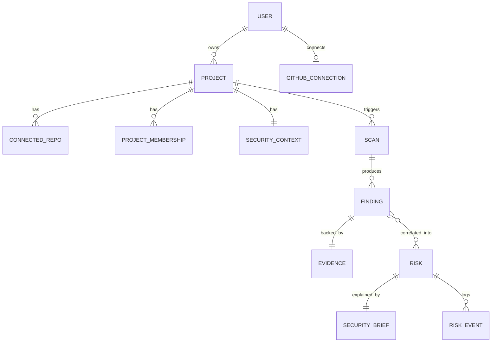
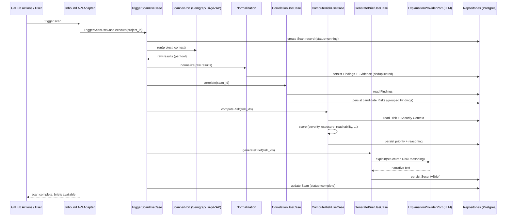

# Verion — Architecture

**Status:** Draft v1.0
**Related:** `PRODUCT_SPEC.md`
**Last updated:** 2026-08-18

---

## 1. Purpose

This document defines how Verion is structured internally: architectural style, module boundaries, the domain model, and how data flows through the scan → correlation → risk → brief pipeline described in `PRODUCT_SPEC.md`.

The goal is not just "a working backend" but a codebase that reads as a **deliberately engineered system** — clear boundaries, explicit dependencies, and decisions that are documented rather than accidental. This matters both for the product's own credibility (a security tool with a sloppy architecture undermines its own pitch) and for what it demonstrates.

---

## 2. Architectural Style: Hexagonal Architecture in a Modular Monolith

Verion uses **Hexagonal Architecture (Ports & Adapters)** at the module level, deployed as a **single modular monolith** (no microservices — see ADR-001).

### 2.1 Why hexagonal architecture fits this product specifically

This isn't architecture for architecture's sake — it maps directly onto Verion's core requirement from the product spec: **every scanner is a replaceable, normalized input; every recommendation must be explainable and traceable.**

- Section 9 of `PRODUCT_SPEC.md` requires that adding a new scanner "should only require a new adapter, not changes to correlation/risk logic." That is, by definition, a **Port** (the contract: `ScannerPort`) with multiple **Adapters** (`SemgrepAdapter`, `TrivyAdapter`, `ZapAdapter`, future ones).
- The Risk/Decision Engine must stay explainable and testable in isolation, with no dependency on FastAPI, PostgreSQL, or any specific scanner's output format. Hexagonal architecture enforces that isolation structurally, not just by convention.
- The AI Explanation Layer (used to generate the Security Brief) is itself swappable — it sits behind a port (`ExplanationProviderPort`) so the LLM provider is an implementation detail, not baked into domain logic.

### 2.2 The Dependency Rule

```
                     ┌─────────────────────────┐
                     │      Inbound Adapters     │
                     │  (REST API, GitHub        │
                     │   webhooks, CLI, CI hook)  │
                     └────────────┬───────────────┘
                                  │ implements calls to
                                  ▼
                     ┌─────────────────────────┐
                     │      Inbound Ports        │
                     │  (Use Case interfaces)    │
                     └────────────┬───────────────┘
                                  ▼
              ┌───────────────────────────────────────┐
              │           Application Layer            │
              │   (Use Cases / Services orchestrate     │
              │    the Domain — no framework code here) │
              └────────────┬────────────────────────────┘
                            ▼
              ┌───────────────────────────────────────┐
              │               Domain                    │
              │  Entities, Value Objects, Domain          │
              │  Services — pure business logic,          │
              │  zero external dependencies                │
              └────────────┬────────────────────────────┘
                            ▲
                            │ implements
                     ┌─────────────────────────┐
                     │      Outbound Ports        │
                     │  (Repository, Scanner,     │
                     │   Explanation, VCS, Queue)  │
                     └────────────┬───────────────┘
                                  ▲ implements
                     ┌─────────────────────────┐
                     │     Outbound Adapters      │
                     │ (Postgres repos, Redis,    │
                     │  Semgrep/Trivy/ZAP CLI,     │
                     │  GitHub API, LLM provider)  │
                     └─────────────────────────┘
```

**Rule:** dependencies always point inward. Domain knows nothing about FastAPI, SQLAlchemy, Redis, or any scanner's CLI output. The Application layer orchestrates Domain logic through ports; it does not know which adapter is behind a port at compile time.

---

## 3. Module Boundaries

Rather than one giant hexagon, Verion is split into cohesive **modules**, each with its own domain/application/ports, sharing infrastructure adapters where sensible. This is what makes the monolith "modular" rather than a ball of mud.

| Module | Responsibility |
|---|---|
| **Identity** | Users, auth, RBAC, project membership |
| **Projects** | Projects, connected repositories, Security Context |
| **Scanning** | Triggering scans, orchestrating scanner adapters, ingesting raw output |
| **Normalization** | Converting raw scanner output into the common `Finding` schema, deduplication |
| **Correlation** | Grouping related Findings into candidate Risks |
| **RiskEngine** | Scoring, prioritizing, explaining Risk (severity, exposure, reachability, confidence) |
| **Brief** | Generating the Security Brief via the AI Explanation Layer, evidence linking |
| **History** | Scan history, risk lifecycle (open/dismissed/resolved), audit log |

Each module exposes its own inbound ports (use cases other modules or the API layer can call) and depends on other modules **only through their ports**, never their internals — e.g., `Correlation` depends on `Normalization`'s `FindingRepositoryPort`, never on its ORM models directly.

---

## 4. Domain Model

### 4.1 Core entities

```
User
 ├── id, email, hashed_password, created_at
 └── (authentication only — no role here; see ProjectMembership below)

GitHubConnection   # M1.5a
 ├── user_id   # natural key, no separate id — one connection per user (MVP)
 ├── access_token   # plaintext; encryption at rest deferred to M10, see GitHubConnectionModel
 ├── github_username
 └── connected_at

Project
 ├── id, owner_id, name, created_at
 ├── connected_repos: [ConnectedRepo]
 └── security_context: SecurityContext

ProjectMembership   # M1.3
 ├── project_id, user_id   # composite natural key, no separate id
 └── role (owner|member)   # per PRODUCT_SPEC.md FR-1: RBAC is project-scoped, not identity-scoped

ConnectedRepo   # named to avoid colliding with the *RepositoryPort persistence-pattern suffix (M1.3)
 ├── id, project_id, provider (github), url, default_branch

SecurityContext
 ├── id, project_id
 ├── language, framework, database
 ├── deployment_target, ci_provider
 ├── exposure_tags: [public_facing, handles_pii, ...]  (user-confirmed)

Scan
 ├── id, project_id, triggered_by, status, started_at, finished_at
 └── raw_results: [ScanResult]   # one per tool that ran

Finding
 ├── id, scan_id, source (semgrep|trivy|zap), vulnerability_type
 ├── severity, confidence, cwe, owasp_category, cvss
 ├── location (file/line or endpoint), evidence: Evidence
 └── dedup_hash

Evidence
 ├── id, finding_id, raw_payload, source_tool, captured_at

Risk
 ├── id, project_id
 ├── findings: [Finding]         # correlated group
 ├── priority (fix_now|plan|monitor)
 ├── confidence, reasoning: RiskReasoning
 ├── status (open|dismissed|resolved)
 └── history: [RiskEvent]

RiskReasoning
 ├── severity_signal, exposure_signal, reachability_signal
 ├── asset_sensitivity_signal, environment_signal
 └── explanation_text   # human-readable, generated but inspectable

SecurityBrief
 ├── id, risk_id
 ├── what_happened, why_it_matters, recommended_action
 ├── estimated_effort, confidence
 └── generated_at
```

### 4.2 Entity relationship overview



---

## 5. Ports Catalog

### 5.1 Inbound ports (use cases — what the outside world can ask Verion to do)

| Port | Purpose |
|---|---|
| `RegisterUserUseCase` / `AuthenticateUserUseCase` | Identity module |
| `ConnectRepositoryUseCase` | Attach a GitHub repo to a project |
| `BuildSecurityContextUseCase` | Extract/refresh Security Context for a project |
| `TriggerScanUseCase` | Start a scan (manual or CI-triggered) |
| `IngestScanResultUseCase` | Accept raw output from a scanner adapter |
| `CorrelateFindingsUseCase` | Run correlation over a scan's findings |
| `ComputeRiskUseCase` | Score and prioritize correlated Risks |
| `GenerateSecurityBriefUseCase` | Produce the developer-facing explanation |
| `ResolveRiskUseCase` / `DismissRiskUseCase` | Change risk lifecycle state, with reason |
| `GetProjectDashboardUseCase` | Read model for the UI |

### 5.2 Outbound ports (what the domain/application needs from the outside world)

| Port | Purpose | Implemented by |
|---|---|---|
| `UserRepositoryPort` | Persist/query users | Postgres adapter |
| `GitHubConnectionRepositoryPort` | Persist/query a user's linked GitHub account | Postgres adapter |
| `GitHubOAuthClientPort` | Build the GitHub authorize URL, exchange an OAuth code for a token + username | `GitHubOAuthClient` |
| `OAuthStateSignerPort` | Sign/verify the OAuth CSRF `state` param | `GitHubOAuthStateSigner` |
| `ProjectRepositoryPort` | Persist/query projects | Postgres adapter |
| `ProjectMembershipRepositoryPort` | Persist/query project RBAC memberships | Postgres adapter |
| `ConnectedRepoRepositoryPort` | Persist/query connected repositories | Postgres adapter |
| `SecurityContextRepositoryPort` | Persist/query a project's Security Context | Postgres adapter (M2.3) |
| `FindingRepositoryPort` | Persist/query findings, dedup lookups | Postgres adapter |
| `RiskRepositoryPort` | Persist/query risks, history | Postgres adapter |
| `ScannerPort` | Run a scan and return raw results | `SemgrepAdapter`, `TrivyAdapter`, `ZapAdapter` |
| `VcsProviderPort` | Read repo metadata, register webhooks | `GitHubAdapter` |
| `ExplanationProviderPort` | Generate natural-language brief text from structured Risk data | LLM adapter (provider-agnostic) |
| `JobQueuePort` | Enqueue/dequeue background work | Redis adapter |
| `DnsResolverPort` | Resolve a hostname to its IP addresses, for `ZapAdapter`'s DNS-rebinding SSRF check | `SystemDnsResolver` |
| `ClockPort` / `IdGeneratorPort` | Testability (deterministic time/IDs in tests) | Trivial adapters |

This split is what makes the Risk Engine and Correlation Engine unit-testable with zero infrastructure: tests instantiate the domain/application layer with in-memory fakes of these ports.

**Convention (established M0.3):** most ports above belong to the module that needs them. `ClockPort`/`IdGeneratorPort` don't — they're cross-cutting, owned by no single module. Cross-cutting ports like these are defined as `Protocol`s in `shared_kernel/`; their concrete adapters (e.g. `SystemClock`, `UuidIdGenerator`) live in `platform/`, alongside the rest of the framework/infra wiring.

---

## 6. Adapters Catalog

### 6.1 Inbound adapters
- **REST API** (FastAPI routers) — translates HTTP requests into calls on inbound ports/use cases. Contains no business logic — only request validation (Pydantic) and response shaping.
- **GitHub webhook receiver** — translates push/PR events into `TriggerScanUseCase` calls.
- **CI hook** (GitHub Actions step) — same, triggered from pipeline.

### 6.2 Outbound adapters
- **Postgres repositories** (SQLAlchemy) — one implementation per `*RepositoryPort`.
- **Scanner adapters**: each wraps a tool's CLI/API and maps its native output into the common raw-result format that `Normalization` consumes.
  - `SemgrepAdapter` → runs Semgrep, parses SARIF/JSON.
  - `TrivyAdapter` → runs Trivy, parses JSON output for SCA/container findings.
  - `ZapAdapter` → drives the ZAP Automation Framework via a YAML plan, parses the report.
- **GitHubAdapter** — GitHub REST/GraphQL API client for repo metadata, PR status checks.
- **LLM Explanation adapter** — calls the model provider to turn structured `RiskReasoning` into the `SecurityBrief` narrative. Structured data (scores, evidence) is computed entirely in the domain **before** this call — the LLM explains, it does not decide priority.
- **Redis queue adapter** — background job dispatch for scan orchestration.

---

## 7. Project Structure (Python / FastAPI)

```
(repo root)
├── src/
│   └── verion/
│       ├── modules/
│       │   ├── identity/
│       │   │   ├── domain/            # entities, value objects, domain services
│       │   │   ├── application/       # use cases (implement inbound ports)
│       │   │   ├── ports/              # inbound + outbound port interfaces
│       │   │   └── adapters/
│       │   │       ├── inbound/api/    # FastAPI routers
│       │   │       └── outbound/db/    # SQLAlchemy repository impls
│       │   ├── projects/
│       │   │   └── ... (same shape)
│       │   ├── scanning/
│       │   │   └── adapters/outbound/scanners/
│       │   │       ├── semgrep_adapter.py
│       │   │       ├── trivy_adapter.py
│       │   │       └── zap_adapter.py
│       │   ├── normalization/
│       │   ├── correlation/
│       │   ├── risk_engine/
│       │   ├── brief/
│       │   │   └── adapters/outbound/explanation/
│       │   │       └── llm_adapter.py
│       │   └── history/
│       ├── shared_kernel/               # cross-module value objects (e.g. Severity, CWE)
│       └── platform/                    # framework wiring: FastAPI app, DI container,
│                                         # DB session mgmt, Redis client, settings
├── tests/
│   ├── unit/                    # per-module, domain+application, port fakes only
│   ├── integration/             # real Postgres/Redis, real adapters
│   └── e2e/                     # full pipeline against a sample vulnerable repo
├── docs/
│   ├── PRODUCT_SPEC.md
│   ├── ARCHITECTURE.md
│   └── adr/                     # Architecture Decision Records
└── infra/
    ├── docker-compose.yml
    └── github-actions/
```

Code lives under a `src/verion/` layout rather than flat at the repo root. This is a deliberate deviation from a naive reading of this section: `platform/` is also the name of a Python **standard library module**, and a flat, importable top-level `platform/` package would shadow it the moment the repo root lands on `sys.path` (e.g. running pytest or uvicorn from the repo root) — breaking any third-party library that does `import platform` internally (uvicorn and FastAPI both do). Wrapping everything under `src/verion/` means the real import path is `verion.platform`, never bare `platform`, which avoids the collision entirely without renaming the module itself. Established as of M0.1.

Each module's `domain/` folder has **zero imports** from `adapters/` or any third-party framework — this is enforced with an import-linter rule in CI (see Section 10).

---

## 8. Sequence: Scan → Security Brief Pipeline



Key property: **priority and reasoning are fully computed before the LLM is ever called.** The Explanation Layer narrates a decision that has already been made deterministically — it cannot silently override the Risk Engine's output. This is the structural guarantee behind the "explainable, not black-box" principle from the product spec.

---

## 9. Cross-Cutting Concerns

- **Transactions:** each use case owns a single unit of work; repository adapters expose a `UnitOfWork` pattern so a use case's writes (e.g., persisting a Risk and its RiskEvent) commit atomically.
- **Error handling:** domain-level errors are typed exceptions (e.g., `InvalidSecurityContext`, `ScannerUnavailable`) defined in the domain/application layers; inbound adapters translate them to HTTP status codes — the domain never returns HTTP concepts.
- **Idempotency:** `IngestScanResultUseCase` and `CorrelateFindingsUseCase` are safe to re-run against the same scan (dedup hashes on Findings, upsert semantics on Risks) so a worker crash-and-retry cannot corrupt state.
- **SSRF protection:** the `ZapAdapter` validates and allow-lists target URLs before invoking a scan (see `PRODUCT_SPEC.md` §11) — enforced at the adapter boundary, not left to the tool itself. Validation covers both the target URL's syntax (scheme, literal-IP/localhost hostnames) and the DNS-rebinding case: the hostname's *resolved* IP is checked immediately before use, not just the hostname string (see ADR-0013).
- **Testing strategy per layer:**
  - Domain + Application: unit tests with in-memory fakes for every port — no DB, no network, fast.
  - Adapters: integration tests against real Postgres/Redis (via `docker-compose`) and recorded/replayed scanner output for CI stability.
  - End-to-end: a deliberately vulnerable sample repo run through the full pipeline, asserting the final Security Brief content.

---

## 10. Enforcing the Architecture

To keep this from becoming aspirational documentation that the code drifts away from:

- **Import-linter contracts in CI** (ADR-007): fail the build if `domain/` imports from `adapters/`, or if `domain/`/`application/` import a listed framework. Note the framework check names specific packages rather than detecting "a framework" generically — see `pyproject.toml`'s `framework-isolation` contract for the current list.
- **Port interfaces defined with Python `Protocol`**, adapters type-checked against them by `mypy --strict` in CI (ADR-015). Structural typing means conformance is verified where an adapter meets a port-annotated site — a `platform/di.py` factory's return type, or an explicit annotation at construction — not merely by an adapter existing.
- **A module cannot import another module's `domain/` or `adapters/` directly** — only its published ports. Also an import-linter contract, one per module.

`CLAUDE.md`'s *How these rules are enforced* section is the authoritative, rule-by-rule breakdown of what CI does and does not catch; this list is the architectural summary of it.

---

## 11. Deployment View

```
┌────────────────────────────────────────────┐
│                 Docker Compose               │
│                                              │
│  ┌───────────┐   ┌───────────┐   ┌────────┐ │
│  │  FastAPI   │   │  Workers   │   │ Redis  │ │
│  │  (API)     │   │ (scan/     │   │(queue) │ │
│  │            │   │ correlate/ │   │        │ │
│  │            │   │ risk/brief)│   │        │ │
│  └─────┬──────┘   └─────┬──────┘   └────────┘ │
│        │                │                     │
│        └───────┬────────┘                     │
│                ▼                              │
│         ┌──────────────┐                      │
│         │  PostgreSQL   │                      │
│         └──────────────┘                      │
└────────────────────────────────────────────┘
```

Single deployable unit for MVP; `platform/` wires everything together via dependency injection at startup, so splitting a module into its own service later (if ever needed) means extracting its hexagon, not rewriting it.

---

## 12. Architecture Decision Records (summary)

Full ADRs live in `docs/adr/`. Key decisions so far:

- **ADR-001 — Modular monolith over microservices.** Team size (one person) and MVP timeline (12-16 weeks) don't justify distributed-systems overhead. Module boundaries are enforced in-process so extraction later is possible.
- **ADR-002 — Hexagonal architecture at the module level.** Directly serves two hard product requirements: scanner extensibility (Section 6 of Product Spec) and explainable, testable risk scoring isolated from any framework or LLM dependency.
- **ADR-003 — Explainable scoring, not trained ML, for the Risk Engine in MVP.** Priority must be traceable to explicit signals; a black-box model would undermine the product's core pitch.
- **ADR-004 — LLM sits strictly downstream of scoring.** The Explanation Layer narrates already-computed decisions; it never determines priority itself, closing off a class of prompt-injection-via-scan-output risk as well as keeping output auditable.
- **ADR-006 — `src/verion/` layout.** Avoids `platform/` shadowing Python's stdlib `platform` module (see §7).
- **ADR-007 — import-linter for mechanical architecture enforcement.** Turns the dependency rules above from convention into a CI-enforced, 17-contract check (see §10).
- **ADR-008 — Explicit `Depends()`-based DI wiring, no DI framework.** Every port-to-adapter resolution stays readable at a glance, consistent with ADR-002/ADR-003's "explainable, not black-box" principle.
- **ADR-009 — Verify dependency-safety claims against primary sources before acting.** Process ADR; applies regardless of how confident or recent the claim's source is.
- **ADR-010 — `allow_indirect_imports` for cross-module contracts.** ADR-007's 8 cross-module contracts now allow indirect reachability through `platform/di.py`'s composition root — direct cross-module imports stay fully forbidden.
- **ADR-011 — Subprocess execution safety pattern.** Established with M3.2's `SemgrepAdapter`/repo-cloning (first subprocess execution in the codebase): argument-list-only invocation, input validation before any subprocess call, hard timeouts with explicit process-kill, credentials via environment variables rather than URLs/argv, guaranteed temp-resource cleanup, and output redaction before exceptions/logs. `TrivyAdapter`/`ZapAdapter` (M3.4/M3.5) are expected to follow it. Amended by M3.5 with point #8: killing a `docker run` client process does not stop the container running server-side — an explicit `docker kill <container-name>` is also required. Amended again by M3.5 with point #9, found on the real CI runner after point #8 landed: a host temp directory bind-mounted into a container must have its permissions opened up for the container's own uid — `tempfile.mkdtemp()`'s default 0700 mode passed on local Docker Desktop for Windows but failed on the Linux GitHub Actions runner, where bind mounts don't remap ownership.
- **ADR-012 — Trivy vulnerability DB defaults to a live refresh in production.** Unlike ADR-002's static-ruleset precedent for Semgrep, a vulnerability scanner's value is CVE currency — a frozen DB would silently defeat its purpose. `TrivyAdapter` (M3.4) refreshes live by default; tests pin `skip_db_update=True` against a CI-warmed cache instead.
- **ADR-013 — ZapAdapter target-URL SSRF validation.** A pure syntax check plus a DNS-rebinding check against the actually-resolved IP (via an injectable `DnsResolverPort`), both run before any subprocess/Docker call. Hand-rolled against stdlib only — no maintained third-party SSRF-validation library was found per ADR-009.
- **ADR-014 — GitHub webhook signature verification and delivery handling.** M3.6's inbound webhook receiver — the first unauthenticated-by-default HTTP endpoint in the codebase. HMAC-SHA256 signature verification (`hmac.compare_digest`) runs before any payload content is trusted; a separate `X-GitHub-Delivery`-keyed dedup runs before any project-resolution query, protecting against GitHub's own redelivery behavior; webhook registration composes onto `projects`' existing `VcsProviderPort`/`ConnectRepositoryViaGitHubUseCase` flow, list-then-create for idempotency.

`0005` is reserved for the future risk-scoring-model ADR (`ROADMAP.md` M6.1) and intentionally not yet created.

---

## 13. Next Steps

1. Formalize `docs/adr/` with full ADR entries (context, decision, consequences) for the four above.
2. Data model migration scripts (Alembic) matching Section 4.
3. Define the initial `ScannerPort` and `ExplanationProviderPort` interfaces in code before writing any adapter.
4. Break this into the 16-week roadmap: milestones, issues, and module build order (Identity/Projects → Scanning/Normalization → Correlation → RiskEngine → Brief → History).
