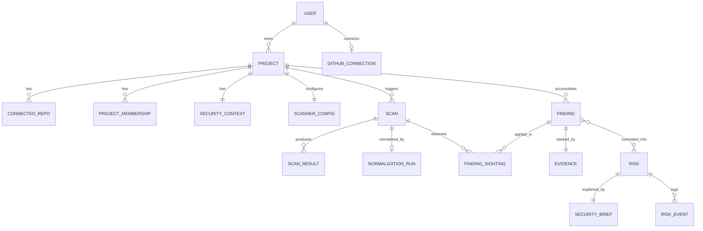

# Verion — Architecture

**Status:** Draft v1.0
**Related:** `PRODUCT_SPEC.md`
**Last updated:** 2026-08-24

---

## 1. Purpose

This document defines how Verion is structured internally: architectural style, module boundaries, the domain model, and how data flows through the scan → correlation → risk → brief pipeline described in `PRODUCT_SPEC.md`.

The goal is not just "a working backend" but a codebase that reads as a **deliberately engineered system** — clear boundaries, explicit dependencies, and decisions that are documented rather than accidental. This matters both for the product's own credibility (a security tool with a sloppy architecture undermines its own pitch) and for what it demonstrates.

---

## 2. Architectural Style: Hexagonal Architecture in a Modular Monolith

Verion uses **Hexagonal Architecture (Ports & Adapters)** at the module level, deployed as a **single modular monolith** (no microservices — see ADR-001).

### 2.1 Why hexagonal architecture fits this product specifically

This isn't architecture for architecture's sake — it maps directly onto Verion's core requirement from the product spec: **every scanner is a replaceable, normalized input; every recommendation must be explainable and traceable.**

- Section 7 of `PRODUCT_SPEC.md` (Non-Functional Requirements → Extensibility) requires that adding a new scanner "should only require a new adapter, not changes to correlation/risk logic." That is, by definition, a **Port** (the contract: `ScannerPort`) with multiple **Adapters** (`SemgrepAdapter`, `TrivyAdapter`, `ZapAdapter`, future ones).
- The Risk/Decision Engine must stay explainable and testable in isolation, with no dependency on FastAPI, PostgreSQL, or any specific scanner's output format. Hexagonal architecture enforces that isolation structurally, not just by convention.
- The AI Explanation Layer (used to generate the Security Brief) is itself swappable — it sits behind a port (`ExplanationProviderPort`) so the LLM provider is an implementation detail, not baked into domain logic.

### 2.2 The Dependency Rule

```
                     ┌─────────────────────────┐
                     │      Inbound Adapters     │
                     │  (REST API, GitHub        │
                     │   webhooks, CLI, CI hook)  │
                     └────────────┬───────────────┘
                                  │ implements calls to
                                  ▼
                     ┌─────────────────────────┐
                     │      Inbound Ports        │
                     │  (Use Case interfaces)    │
                     └────────────┬───────────────┘
                                  ▼
              ┌───────────────────────────────────────┐
              │           Application Layer            │
              │   (Use Cases / Services orchestrate     │
              │    the Domain — no framework code here) │
              └────────────┬────────────────────────────┘
                            ▼
              ┌───────────────────────────────────────┐
              │               Domain                    │
              │  Entities, Value Objects, Domain          │
              │  Services — pure business logic,          │
              │  zero external dependencies                │
              └────────────┬────────────────────────────┘
                            ▲
                            │ implements
                     ┌─────────────────────────┐
                     │      Outbound Ports        │
                     │  (Repository, Scanner,     │
                     │   Explanation, VCS, Queue)  │
                     └────────────┬───────────────┘
                                  ▲ implements
                     ┌─────────────────────────┐
                     │     Outbound Adapters      │
                     │ (Postgres repos, Redis,    │
                     │  Semgrep/Trivy/ZAP CLI,     │
                     │  GitHub API, LLM provider)  │
                     └─────────────────────────┘
```

**Rule:** dependencies always point inward. Domain knows nothing about FastAPI, SQLAlchemy, Redis, or any scanner's CLI output. The Application layer orchestrates Domain logic through ports; it does not know which adapter is behind a port at compile time.

---

## 3. Module Boundaries

Rather than one giant hexagon, Verion is split into cohesive **modules**, each with its own domain/application/ports, sharing infrastructure adapters where sensible. This is what makes the monolith "modular" rather than a ball of mud.

| Module | Responsibility |
|---|---|
| **Identity** | Users, auth, RBAC, project membership |
| **Projects** | Projects, connected repositories, Security Context |
| **Scanning** | Triggering scans, orchestrating scanner adapters, ingesting raw output |
| **Normalization** | Converting raw scanner output into the common `Finding` schema, deduplication |
| **Correlation** | Grouping related Findings into candidate Risks |
| **RiskEngine** | Scoring, prioritizing, explaining Risk (severity, exposure, reachability, confidence) |
| **Brief** | Generating the Security Brief via the AI Explanation Layer, evidence linking |
| **History** | Scan history, risk lifecycle (open/dismissed/resolved), audit log |

Each module exposes its own inbound ports (use cases other modules or the API layer can call) and depends on other modules **only through their ports**, never their internals — e.g., `Correlation` depends on `Normalization`'s `FindingRepositoryPort`, never on its ORM models directly.

---

## 4. Domain Model

### 4.1 Core entities

```
User
 ├── id, email, hashed_password, created_at
 └── (authentication only — no role here; see ProjectMembership below)

GitHubConnection   # M1.5a
 ├── user_id   # natural key, no separate id — one connection per user (MVP)
 ├── access_token   # plaintext; encryption at rest deferred to M10, see GitHubConnectionModel
 ├── github_username
 └── connected_at

Project
 ├── id, owner_id, name, created_at
 ├── connected_repos: [ConnectedRepo]
 └── security_context: SecurityContext

ProjectMembership   # M1.3
 ├── project_id, user_id   # composite natural key, no separate id
 └── role (owner|member)   # per PRODUCT_SPEC.md FR-1: RBAC is project-scoped, not identity-scoped

ConnectedRepo   # named to avoid colliding with the *RepositoryPort persistence-pattern suffix (M1.3)
 ├── id, project_id, provider (github), url, default_branch

SecurityContext
 ├── id, project_id
 ├── language, framework, database
 ├── deployment_target, ci_provider
 ├── exposure_tags: [public_facing, handles_pii, ...]  (user-confirmed)

ScannerConfig   # M3.7 — projects; operational config, deliberately not on SecurityContext
 ├── id, project_id   # UNIQUE — one row per project
 ├── enabled_tools: [ScannerTool]   # absent row = never configured (default); [] = run nothing
 ├── zap_target_url   # nullable; tool-specific, accepted as debt (ADR-016 decision 3, G2)
 └── updated_at

Scan
 ├── id, project_id, triggered_by, status, started_at, finished_at
 ├── failure_reason   # M3.3; a failure BEFORE any tool ran — never a per-tool failure
 └── raw_results: [ScanResult]   # one per tool that ran
 # status is a DERIVED, human-facing summary of the per-tool outcomes below
 # (completed|partial|failed). No pipeline stage is ever added to it, and no
 # pipeline reads it — M4 reads ScanResultRepositoryPort.get_succeeded_by_scan_id.
 # See ADR-016 decision 2 and ADR-0017 decision 1.

ScanResult   # M3.7 — one row per tool that was attempted, including one that failed
 ├── id, scan_id, tool   # UNIQUE(scan_id, tool) — the upsert key that keeps retries idempotent
 ├── status (succeeded|failed)
 ├── raw_output      # nullable; non-null iff succeeded, enforced by a CHECK constraint
 └── failure_reason  # nullable; non-null iff failed

NormalizationRun   # M4.0 — normalization; pipeline progress, one row per Scan
 ├── id, scan_id   # UNIQUE — the idempotency key; the row IS the scan→normalize outbox
 ├── project_id    # M4.3 — the dedup scope, which normalization can reach no other way:
 │                 # the sweep selects on this table alone (ADR-0017 decision 2), so a read
 │                 # port back into scanning could not supply it. No FK, like scan_id.
 │                 # Written by RunScanUseCase through the primitives-only port, which
 │                 # gained the parameter here (ADR-0019 decision 7, ADR-0017 Amendments).
 ├── status (pending|running|completed|failed)
 ├── requested_at, started_at, finished_at
 └── failure_reason   # nullable; non-null iff failed. Never Scan.failure_reason.
 # Written by RunScanUseCase in the same transaction as the ScanResult rows.
 # Exists iff ScanResult rows were persisted. See ADR-0017.

Finding   # M4.1 — normalization; produced by the per-scanner mappers
 ├── id, project_id                     # DURABLE and project-scoped, NOT scan-scoped
 ├── dedup_hash                         # derived property, never assigned: "v1:<sha256>"
 ├── source: ScannerTool                # shared_kernel/scanner_tools.py — not a literal set
 ├── rule_id                            # the tool's own identifier for WHAT fired:
 │                                      # check_id / VulnerabilityID / alertRef
 ├── severity: Severity                 # shared_kernel/severity.py — the normalized scale
 ├── native_severity                    # what the tool literally said ("ERROR", "CRITICAL", "Low")
 ├── title
 ├── cwe, owasp_category, cvss          # nullable; None means the tool supplied nothing
 ├── location: Location, evidence: Evidence
 # A Finding OUTLIVES the scan that produced it (ADR-0019, resolving G5): FR-5 requires
 # dedup across repeated scans, and one scan_id could only ever mean "first" or "latest".
 # Per-scan observation is FindingSighting below. Deliberately NO last_seen_at /
 # last_seen_scan_id: both are max() over sightings, and a denormalized copy would put a
 # summary that can silently go stale into M9.1's path (ADR-016 decision 2's objection).
 # dedup_hash is over source + rule_id + file_path + package + url + http_method +
 # parameter, and NOT over lines, installed_version, severity, cvss, cwe or title — those
 # change without the finding changing, and re-keying on them fabricates resolution events.
 # severity collapses three incompatible tool scales into one, so it is lossy for
 # ORDERING; native_severity is what keeps it lossless for PROVENANCE (FR-9).
 # A field with no source is None — never "" and never a guess, or a mapper would
 # be inventing a Risk Engine input (rule 5). See ADR-0018.
 # NOT here yet:
 #   confidence  — M6.1. Only ZAP supplies it, as an opaque numeric code whose
 #                 vocabulary mixes degrees with states (Confirmed/False Positive),
 #                 and RiskReasoning's five signals do not include it.

FindingSighting   # M4.2 — normalization; one scan's observation of one Finding
 ├── finding_id, scan_id   # composite natural key, no surrogate id (ProjectMembership's shape)
 ├── observed_at
 └── match_count           # source elements that collapsed into this identity in this scan
 # ABSENCE is the point: "not sighted in scan N" is the absence of a row, and "scan N was
 # never normalized" is NormalizationRun — which exists iff ScanResult rows were persisted.
 # The two compose into the distinction M9.1 needs, with no third state.
 # M9.1 CONSTRAINT: "not sighted in the latest scan" only means resolved for the tools that
 # SUCCEEDED in that scan. A failed Trivy makes a scan PARTIAL and contributes no SCA
 # findings; a naive absence check would silently resolve every dependency finding.
 # get_succeeded_by_scan_id already draws that line. See ADR-0019's Consequences.
 # Written by the normalization use case (M4.4), never by a mapper: identity is the hash
 # and id is a surrogate, so only the upsert on (project_id, dedup_hash) settles which wins.

Location   # M4.1 — an EMBEDDED value object on Finding, not an entity: no id, no
           # table of its own, and deliberately absent from the §4.2 ERD. One flat
           # shape, not a tagged union of three.
 ├── file_path, start_line, end_line          # Semgrep
 ├── package, installed_version               # Trivy
 └── url, http_method, parameter              # ZAP
 # All nullable, and an all-None Location is valid (a ZAP site-level alert can
 # carry no instances). A tagged union would force downstream readers to branch on
 # which tool produced the finding — per-tool knowledge past normalization, which
 # is the leak the common schema exists to prevent.

Evidence
 ├── id, finding_id, scan_id, raw_payload, source_tool: ScannerTool, captured_at
 # raw_payload is a verbatim COPY of the one source element (a Semgrep result, a
 # Trivy vulnerability, a ZAP alert narrowed to one instance), not a reference into
 # ScanResult.raw_output: that blob is replaceable by a retry's upsert, so a
 # reference would dangle silently. ADR-0018 decision 6, clarified by ADR-0019.
 # ONE row per Finding, holding the LATEST observation's payload — refreshed on every
 # sighting, unconditionally. FR-9 asks for the output that produced THIS assessment,
 # and deciding an older payload was "richer" would need per-tool comparison. scan_id
 # records which scan the retained payload came from; ScanResult.raw_output is the
 # floor for anything older. Per-sighting retention is M9.2's trigger.

Risk
 ├── id, project_id
 ├── findings: [Finding]         # correlated group
 ├── priority (fix_now|plan|monitor)
 ├── confidence, reasoning: RiskReasoning
 ├── status (open|dismissed|resolved)
 └── history: [RiskEvent]

RiskReasoning
 ├── severity_signal, exposure_signal, reachability_signal
 ├── asset_sensitivity_signal, environment_signal
 └── explanation_text   # human-readable, generated but inspectable

SecurityBrief
 ├── id, risk_id
 ├── what_happened, why_it_matters, recommended_action
 ├── estimated_effort, confidence
 └── generated_at
```

### 4.2 Entity relationship overview



---

## 5. Ports Catalog

### 5.1 Inbound ports (use cases — what the outside world can ask Verion to do)

| Port | Purpose |
|---|---|
| `RegisterUserUseCase` / `AuthenticateUserUseCase` | Identity module |
| `ConnectRepositoryUseCase` | Attach a GitHub repo to a project |
| `BuildSecurityContextUseCase` | Extract/refresh Security Context for a project |
| `TriggerScanUseCase` | Create a `Scan` and enqueue it — it does **not** orchestrate the pipeline |
| `RunScanUseCase` | The worker's entry point: run every enabled scanner, persist `ScanResult` rows, hand off to normalization |
| `NormalizeScanUseCase` | The normalization job's entry point: map a scan's *succeeded* raw output into `Finding` rows, collapse by identity, record one `FindingSighting` per identity, and transition the `NormalizationRun` (M4.4) |
| `SweepPendingNormalizationsUseCase` | The reconciliation backstop: re-enqueue normalization for runs that are owed and not progressing. Selects on `normalization_runs` alone, never `Scan.status` (M4.4) |
| `ListProjectFindingsUseCase` | A project's findings with each one's sighting aggregate, filtered and paged, plus the normalization state that says whether the list is complete. Project-scoped and scan-independent — it reports when a finding was last seen, never whether it is resolved (M4.5) |
| `GetFindingEvidenceUseCase` | One finding's verbatim tool output — FR-9's link, followed. The only route that returns scanned content, deliberately separate from the listing (M4.5, ADR-0022) |
| `CorrelateFindingsUseCase` | Group related `Finding`s into candidate Risks. **Its scope is a PROJECT's findings, not one scan's** — M5.8's criterion (a), decided 2026-08-26 in ADR-0023's `## Amendments` before any matching code, on four grounds: it is the scope `Finding` itself has (ADR-0019 decision 1), the scope M5.1's measured grouping has, the one whose alternative costs M9.1's four criteria rather than a `WHERE` clause, and the only one a completeness envelope exists for today. *(This clause said the scope was **M5.1's decision and deliberately not stated here** until 2026-08-25, then **M5.8's** until 2026-08-26. Rewritten inline and dated each time, on the precedent this row sets for itself in the next sentence. M5.1 closed without taking the decision and without building the use case — `ROADMAP.md` **G30**; M5.8 has now taken it, and the "M5.1" in the next sentence is left as written and reads M5.8 too. **That next sentence is now a counterfactual and stays anyway**, for the reason it was kept when the decision was still open: the cost it states is what makes the choice above reviewable — a reader who wants to overturn per-project scope needs to see what scan scoping would have cost, and deleting it would leave the decision asserted with its price removed.)* This row said "over a scan's findings" until the M4→M5 boundary review, which is a query `FindingRepositoryPort` deliberately does not offer: `scan_id` is not the leading column of the sightings primary key, and the scan-first read, its index, the absence check and the succeeded-tools caveat are M9.1's acceptance criteria, together. §8 drew the same stage as an unscoped `read Findings`, so the two sections disagreed and this one was the more specific. M5.1 choosing scan scoping means building M9.1's query first, not inheriting it |
| `ComputeRiskUseCase` | Score and prioritize correlated Risks |
| `GenerateSecurityBriefUseCase` | Produce the developer-facing explanation |
| `ResolveRiskUseCase` / `DismissRiskUseCase` | Change risk lifecycle state, with reason |
| `GetProjectDashboardUseCase` | Read model for the UI |

### 5.2 Outbound ports (what the domain/application needs from the outside world)

| Port | Purpose | Implemented by |
|---|---|---|
| `UserRepositoryPort` | Persist/query users | Postgres adapter |
| `GitHubConnectionRepositoryPort` | Persist/query a user's linked GitHub account | Postgres adapter |
| `GitHubOAuthClientPort` | Build the GitHub authorize URL, exchange an OAuth code for a token + username | `GitHubOAuthClient` |
| `OAuthStateSignerPort` | Sign/verify the OAuth CSRF `state` param | `GitHubOAuthStateSigner` |
| `ProjectRepositoryPort` | Persist/query projects | Postgres adapter |
| `ProjectMembershipRepositoryPort` | Persist/query project RBAC memberships | Postgres adapter |
| `ProjectAccessPort` | **Whether a caller may read a project — the verdict, not the rows** (M4.5). The port ANOTHER module uses to authorize a project-scoped read; `ProjectMembershipRepositoryPort` above is persistence and is the wrong one for that, because consuming it puts "authorization means a membership row exists" in every consuming module. Returns one `bool`, so no consumer can distinguish "no such project" from "not a member" and every one of them answers 404. The rule stays in `projects/domain/authorization.may_read`. ADR-0022 decision 2; the shape M5.2/M6.3/M7.2/M8.2 copy | `PostgresProjectAccessReader` |
| `ConnectedRepoRepositoryPort` | Persist/query connected repositories | Postgres adapter |
| `SecurityContextRepositoryPort` | Persist/query a project's Security Context | Postgres adapter (M2.3) |
| `ScannerConfigRepositoryPort` | Persist/query which scanners a project runs; read by `scanning` (M3.7) | Postgres adapter |
| `ScanRepositoryPort` | Persist/query scans | Postgres adapter |
| `ScanResultRepositoryPort` | Persist per-tool raw output; `get_succeeded_by_scan_id` is **M4's entry point** (M3.7) | Postgres adapter |
| `NormalizationRunRepositoryPort` | Record that normalization is owed for a scan, and read it back (M4.0); since M4.4 also `claim` (a row-locked `pending`/`running`/`failed` → `running` transition — `completed` is the only terminal state), `update`, and `get_stale` for the sweep; since M4.5 `get_latest_by_project_id` and `count_unfinished_by_project_id`, which are what let a findings response say whether it is complete (G15). Its `request` method takes primitives so `scanning` can call it without importing `normalization`'s domain; the M4.4 methods take the entity, because only `normalization` calls them | Postgres adapter |
| `FindingRepositoryPort` | Upsert findings on `(project_id, dedup_hash)` — keeping the stored `id` and refreshing the mutable attributes per `merge_observation` — record `FindingSighting` rows, and query by project (M4.3); since M4.5 `list_for_project` (filtered, paged, severity-ranked, each item carrying its sighting aggregate), `count_for_project` and a project-scoped `get_by_id`. `get_by_project_id` is kept alongside the listing deliberately — it does not require the sighting invariant, so the write path is verified by a reader that is not the read path. `upsert` **returns** the resolved `Finding`, because only it settles which surrogate `id` wins and M4.4 needs that to write a sighting; `record_sighting` takes a per-scan **total**, never an increment (ADR-0020) | Postgres adapter |
| `RiskRepositoryPort` | Persist/query risks, history | Postgres adapter |
| `ScannerPort` | Run a scan and return raw results | `SemgrepAdapter`, `TrivyAdapter`, `ZapAdapter` |
| `VcsProviderPort` | Read repo metadata, register webhooks | `GitHubAdapter` |
| `ExplanationProviderPort` | Generate natural-language brief text from structured Risk data | LLM adapter (provider-agnostic) |
| `JobQueuePort` | Enqueue a scan job (`scanning`) | Redis/arq adapter |
| `NormalizationQueuePort` | Enqueue a normalization job (`normalization`, M4.4). A separate port rather than a method on `JobQueuePort`, because the job belongs to this module. **Losing a message here is not an error**: the `normalization_runs` row is the durable record and the sweep recovers it (ADR-0017 decision 2) | Redis/arq adapter |
| `DnsResolverPort` | Resolve a hostname to its IP addresses, for `ZapAdapter`'s DNS-rebinding SSRF check | `SystemDnsResolver` |
| `ClockPort` / `IdGeneratorPort` | Testability (deterministic time/IDs in tests) | Trivial adapters |

This split is what makes the Risk Engine and Correlation Engine unit-testable with zero infrastructure: tests instantiate the domain/application layer with in-memory fakes of these ports.

**Convention (established M0.3):** most ports above belong to the module that needs them. `ClockPort`/`IdGeneratorPort` don't — they're cross-cutting, owned by no single module. Cross-cutting ports like these are defined as `Protocol`s in `shared_kernel/`; their concrete adapters (e.g. `SystemClock`, `UuidIdGenerator`) live in `platform/`, alongside the rest of the framework/infra wiring.

---

## 6. Adapters Catalog

### 6.1 Inbound adapters
- **REST API** (FastAPI routers) — translates HTTP requests into calls on inbound ports/use cases. Contains no business logic — only request validation (Pydantic) and response shaping.
- **GitHub webhook receiver** — translates push/PR events into `TriggerScanUseCase` calls.
- **CI hook** (GitHub Actions step) — same, triggered from pipeline.

### 6.2 Outbound adapters
- **Postgres repositories** (SQLAlchemy) — one implementation per `*RepositoryPort`.
- **Scanner adapters**: each wraps a tool's CLI/API and maps its native output into the common raw-result format that `Normalization` consumes.
  - `SemgrepAdapter` → runs Semgrep, parses SARIF/JSON.
  - `TrivyAdapter` → runs Trivy, parses JSON output for SCA/container findings.
  - `ZapAdapter` → drives the ZAP Automation Framework via a YAML plan, parses the report.
- **GitHubAdapter** — GitHub REST/GraphQL API client for repo metadata, PR status checks.
- **LLM Explanation adapter** — calls the model provider to turn structured `RiskReasoning` into the `SecurityBrief` narrative. Structured data (scores, evidence) is computed entirely in the domain **before** this call — the LLM explains, it does not decide priority.
- **Redis queue adapter** — background job dispatch for scan orchestration.

---

## 7. Project Structure (Python / FastAPI)

```
(repo root)
├── src/
│   └── verion/
│       ├── modules/
│       │   ├── identity/
│       │   │   ├── domain/            # entities, value objects, domain services
│       │   │   ├── application/       # use cases (implement inbound ports)
│       │   │   ├── ports/              # inbound + outbound port interfaces
│       │   │   └── adapters/
│       │   │       ├── inbound/api/    # FastAPI routers
│       │   │       └── outbound/db/    # SQLAlchemy repository impls
│       │   ├── projects/
│       │   │   └── ... (same shape)
│       │   ├── scanning/
│       │   │   └── adapters/outbound/scanners/
│       │   │       ├── semgrep_adapter.py
│       │   │       ├── trivy_adapter.py
│       │   │       └── zap_adapter.py
│       │   ├── normalization/
│       │   ├── correlation/
│       │   ├── risk_engine/
│       │   ├── brief/
│       │   │   └── adapters/outbound/explanation/
│       │   │       └── llm_adapter.py
│       │   └── history/
│       ├── shared_kernel/               # cross-cutting Protocols + shared vocabulary
│       └── platform/                    # framework wiring: FastAPI app, DI container,
│                                         # DB session mgmt, Redis client, settings
├── tests/
│   ├── unit/                    # per-module, domain+application, port fakes only
│   ├── integration/             # real Postgres/Redis, real adapters
│   └── e2e/                     # full pipeline against a sample vulnerable repo
├── docs/
│   ├── PRODUCT_SPEC.md
│   ├── ARCHITECTURE.md
│   └── adr/                     # Architecture Decision Records
└── infra/
    ├── docker-compose.yml
    └── github-actions/
```

Code lives under a `src/verion/` layout rather than flat at the repo root. This is a deliberate deviation from a naive reading of this section: `platform/` is also the name of a Python **standard library module**, and a flat, importable top-level `platform/` package would shadow it the moment the repo root lands on `sys.path` (e.g. running pytest or uvicorn from the repo root) — breaking any third-party library that does `import platform` internally (uvicorn and FastAPI both do). Wrapping everything under `src/verion/` means the real import path is `verion.platform`, never bare `platform`, which avoids the collision entirely without renaming the module itself. Established as of M0.1.

Each module's `domain/` folder has **zero imports** from `adapters/` or any third-party framework — this is enforced with an import-linter rule in CI (see Section 10).

**What `shared_kernel/` takes, stated as a criterion rather than a list** (ADR-0018, extending the widening ADR-016 decision 4 recorded when it added `ScannerTool`):

> `shared_kernel/` takes **closed vocabularies** — enumerations — that two or more modules must **compare or order**, not merely **transport**. Entities and structures stay with the module that owns them and travel by indirect import.

The scope clause is load-bearing. An enum's *members* are the shared knowledge: to write `severity >= Severity.HIGH` you must import the type by name, and `risk_engine` may not import `normalization`'s domain (rule 3). A structure's *fields* are reachable by attribute without importing the type — `scanning` reads `connected_repo.url` today without `ConnectedRepo` living here. Without the clause the criterion would pull in `Location`, then `Finding`, and hollow out `normalization/domain/`.

Applied so far: `ClockPort`/`IdGeneratorPort` (cross-cutting Protocols, M0.3), `ScannerTool` (ADR-016), `Severity` (ADR-0018). Declined under the same criterion: `Confidence` and `Location` (both ADR-0018).

---

## 8. Sequence: Scan → Security Brief Pipeline

**The pipeline is a chain of enqueued stages, not one synchronous call.** Each stage persists its output and records that the next stage is owed, in one transaction; the queue only makes the handoff prompt. The API returns as soon as the `Scan` is enqueued — nothing downstream is awaited on the request path.

```mermaid
sequenceDiagram
    participant CI as GitHub Actions / User
    participant API as Inbound API Adapter
    participant Trig as TriggerScanUseCase
    participant Q as JobQueuePort (Redis/arq)
    participant Run as RunScanUseCase (worker)
    participant Sc as ScannerPort (Semgrep/Trivy/ZAP)
    participant Norm as Normalization (worker)
    participant Sweep as Sweep cron (worker)
    participant Corr as CorrelateFindingsUseCase
    participant Risk as ComputeRiskUseCase
    participant Brief as GenerateSecurityBriefUseCase
    participant Exp as ExplanationProviderPort (LLM)
    participant DB as Repositories (Postgres)

    CI->>API: trigger scan (push webhook)
    API->>Trig: TriggerScanUseCase.execute(project_id)
    Trig->>DB: create Scan (status=pending)
    Trig->>Q: enqueue run_scan(scan_id)
    API-->>CI: 202 Accepted — enqueued, nothing computed yet

    Q->>Run: run_scan(scan_id)
    Run->>DB: update Scan (status=running)
    Run->>Sc: run(target) — every enabled tool, concurrently, one checkout
    Sc-->>Run: raw output, per tool (a failing tool returns an outcome, not an error)
    Note over Run,DB: one transaction, in this order
    Run->>DB: upsert ScanResult rows (scan_id, tool)
    Run->>DB: NormalizationRun (status=pending) — the handoff, written BEFORE the line below
    Run->>DB: update Scan (status=completed|partial|failed — scanners only)
    Run->>Q: enqueue normalize_scan(scan_id) — a latency optimization; the row is the record

    Q->>Norm: normalize_scan(scan_id)
    Norm->>DB: claim NormalizationRun (pending|running|failed -> running) — own transaction
    Norm->>DB: read get_succeeded_by_scan_id(scan_id) — never Scan.status
    Norm->>DB: upsert Findings on (project_id, dedup_hash) + refresh Evidence
    Norm->>DB: record a FindingSighting per finding (finding_id, scan_id)
    Norm->>DB: NormalizationRun (status=completed|failed)

    Note over Sweep,Q: every 5 min, independent of any scan
    Sweep->>DB: stale NormalizationRuns (pending|running, requested_at < now-15m)
    Sweep->>Q: enqueue normalize_scan(scan_id) — recovers a lost enqueue

    Corr->>DB: read Findings
    Corr->>DB: persist candidate Risks (grouped Findings)
    Risk->>DB: read Risk + Security Context
    Risk->>Risk: score (severity, exposure, reachability, ...)
    Risk->>DB: persist priority + reasoning
    Brief->>Exp: explain(structured RiskReasoning)
    Exp-->>Brief: narrative text
    Brief->>DB: persist SecurityBrief
```

Three properties this diagram is drawn to make visible, each load-bearing:

- **`Scan.status` is scanner-scoped and terminal at `RunScanUseCase`.** `completed` means every enabled scanner finished, *not* that the pipeline finished. It is a derived, human-facing summary; no stage downstream reads it (ADR-016 decision 2, ADR-0017 decision 1).
- **The `NormalizationRun` row is written before the `Scan` status update, in the same transaction as the `ScanResult` rows.** That ordering is a constraint, not a detail: reversed, a failure writing it would still commit `completed`, and the retry would short-circuit at `RunScanUseCase`'s `== COMPLETED` guard, losing normalization silently and permanently (ADR-0017 decision 2).
- **Priority and reasoning are fully computed before the LLM is ever called.** The Explanation Layer narrates a decision already made deterministically — it cannot silently override the Risk Engine. This is the structural guarantee behind the "explainable, not black-box" principle from the product spec.

- **Normalization's own progress is a state machine, and `completed` is its only terminal state.** The job claims the row in a transaction of its own before doing any work, so a worker killed mid-flight leaves an observable `running` row rather than being indistinguishable from one that never started — which is what the sweep needs in order to recover it. `failed` is deliberately re-claimable: the job writes it and re-raises for a transient failure, and a terminal `failed` would make arq's retry silently do nothing (ADR-0021 decision 3).
- **The sweep is a backstop, not the trigger, and it selects on `normalization_runs` alone.** The enqueue above is what makes normalization prompt; the sweep only bounds how late a *lost* message is noticed. It must never read `Scan.status` — ADR-0017 decision 2 states that as an invariant, because a sweep filtering on a derived, human-facing summary would put the decision of whether to run the stage downstream of exactly what ADR-016 decision 2 forbids the stage itself to read.

Stages after normalization are drawn as designed, not as built: `correlation`, `risk_engine` and `brief` are M5-M7, and how each is triggered is that milestone's decision. M5 inherits the handoff pattern above as a precedent, not as a constraint (ADR-0017).

---

## 9. Cross-Cutting Concerns

- **Transactions:** each use case owns a single unit of work; repository adapters expose a `UnitOfWork` pattern so a use case's writes (e.g., persisting a Risk and its RiskEvent) commit atomically. **One deliberate exception, for pipeline-stage handoffs only:** a use case's unit of work may span two modules' tables when the second write *is* the handoff to the next stage — `RunScanUseCase` writes `scanning`'s `ScanResult` rows and `normalization`'s `NormalizationRun` row in one transaction, which is what removes the Postgres-commit-plus-Redis-enqueue dual write (ADR-0017 decision 1). The boundary that remains enforceable is kept: the port's write method takes primitives, so no other module's domain type crosses. This licenses stage handoffs, not cross-module writes generally.
- **Error handling:** domain-level errors are typed exceptions (e.g., `InvalidSecurityContext`, `ScannerUnavailable`) defined in the domain/application layers; inbound adapters translate them to HTTP status codes — the domain never returns HTTP concepts.
- **Idempotency:** every stage is safe to re-run against the same scan, because each one's write is keyed rather than appended. `RunScanUseCase` upserts `ScanResult` on `(scan_id, tool)` and requests normalization with `ON CONFLICT DO NOTHING` on `scan_id`; the webhook receiver dedups on `X-GitHub-Delivery`; normalization upserts `Finding` on `(project_id, dedup_hash)` and records a `FindingSighting` keyed `(finding_id, scan_id)`, so re-normalizing a scan refreshes rows rather than adding them (ADR-0019), and correlation adds upsert semantics on Risks. So a worker crash-and-retry cannot corrupt state. Note the one thing a retry does *not* preserve: re-running a scan re-runs **every** enabled scanner, which can turn a succeeded `ScanResult` into a failed one — the reason a scanner failure no longer re-raises (ADR-016).
- **SSRF protection:** the `ZapAdapter` validates and allow-lists target URLs before invoking a scan (see `PRODUCT_SPEC.md` §11) — enforced at the adapter boundary, not left to the tool itself. Validation covers both the target URL's syntax (scheme, literal-IP/localhost hostnames) and the DNS-rebinding case: the hostname's *resolved* IP is checked immediately before use, not just the hostname string (see ADR-0013).
- **Testing strategy per layer:**
  - Domain + Application: unit tests with in-memory fakes for every port — no DB, no network, fast.
  - Adapters: integration tests against real Postgres/Redis (via `docker-compose`) and recorded/replayed scanner output for CI stability.
  - End-to-end: a deliberately vulnerable sample repo run through the full pipeline, asserting the final Security Brief content.

---

## 10. Enforcing the Architecture

To keep this from becoming aspirational documentation that the code drifts away from:

- **Import-linter contracts in CI** (ADR-007): fail the build if `domain/` imports from `adapters/`, or if `domain/`/`application/` import a listed framework. Note the framework check names specific packages rather than detecting "a framework" generically — see `pyproject.toml`'s `framework-isolation` contract for the current list.
- **Port interfaces defined with Python `Protocol`**, adapters type-checked against them by `mypy --strict` in CI (ADR-015). Structural typing means conformance is verified where an adapter meets a port-annotated site — a `platform/di.py` factory's return type, or an explicit annotation at construction — not merely by an adapter existing.
- **A module cannot import another module's `domain/` or `adapters/` directly** — only its published ports. Also an import-linter contract, one per module.

`CLAUDE.md`'s *How these rules are enforced* section is the authoritative, rule-by-rule breakdown of what CI does and does not catch; this list is the architectural summary of it.

---

## 11. Deployment View

```
┌────────────────────────────────────────────┐
│                 Docker Compose               │
│                                              │
│  ┌───────────┐   ┌───────────┐   ┌────────┐ │
│  │  FastAPI   │   │  Workers   │   │ Redis  │ │
│  │  (API)     │   │ (scan/     │   │(queue) │ │
│  │            │   │ correlate/ │   │        │ │
│  │            │   │ risk/brief)│   │        │ │
│  └─────┬──────┘   └─────┬──────┘   └────────┘ │
│        │                │                     │
│        └───────┬────────┘                     │
│                ▼                              │
│         ┌──────────────┐                      │
│         │  PostgreSQL   │                      │
│         └──────────────┘                      │
└────────────────────────────────────────────┘
```

Single deployable unit for MVP; `platform/` wires everything together via dependency injection at startup, so splitting a module into its own service later (if ever needed) means extracting its hexagon, not rewriting it.

---

## 12. Architecture Decision Records (summary)

Full ADRs live in `docs/adr/`. Key decisions so far:

- **ADR-001 — Modular monolith over microservices.** Team size (one person) and MVP timeline (12-16 weeks) don't justify distributed-systems overhead. Module boundaries are enforced in-process so extraction later is possible.
- **ADR-002 — Hexagonal architecture at the module level.** Directly serves two hard product requirements: scanner extensibility (Section 7 of Product Spec, Non-Functional Requirements → Extensibility) and explainable, testable risk scoring isolated from any framework or LLM dependency.
- **ADR-003 — Explainable scoring, not trained ML, for the Risk Engine in MVP.** Priority must be traceable to explicit signals; a black-box model would undermine the product's core pitch.
- **ADR-004 — LLM sits strictly downstream of scoring.** The Explanation Layer narrates already-computed decisions; it never determines priority itself, closing off a class of prompt-injection-via-scan-output risk as well as keeping output auditable.
- **ADR-006 — `src/verion/` layout.** Avoids `platform/` shadowing Python's stdlib `platform` module (see §7).
- **ADR-007 — import-linter for mechanical architecture enforcement.** Turns the dependency rules above from convention into a CI-enforced, 17-contract check (see §10).
- **ADR-008 — Explicit `Depends()`-based DI wiring, no DI framework.** Every port-to-adapter resolution stays readable at a glance, consistent with ADR-002/ADR-003's "explainable, not black-box" principle.
- **ADR-009 — Verify dependency-safety claims against primary sources before acting.** Process ADR; applies regardless of how confident or recent the claim's source is.
- **ADR-010 — `allow_indirect_imports` for cross-module contracts.** ADR-007's 8 cross-module contracts now allow indirect reachability through `platform/di.py`'s composition root — direct cross-module imports stay fully forbidden.
- **ADR-011 — Subprocess execution safety pattern.** Established with M3.2's `SemgrepAdapter`/repo-cloning (first subprocess execution in the codebase): argument-list-only invocation, input validation before any subprocess call, hard timeouts with explicit process-kill, credentials via environment variables rather than URLs/argv, guaranteed temp-resource cleanup, and output redaction before exceptions/logs. `TrivyAdapter`/`ZapAdapter` (M3.4/M3.5) are expected to follow it. Amended by M3.5 with point #8: killing a `docker run` client process does not stop the container running server-side — an explicit `docker kill <container-name>` is also required. Amended again by M3.5 with point #9, found on the real CI runner after point #8 landed: a host temp directory bind-mounted into a container must have its permissions opened up for the container's own uid — `tempfile.mkdtemp()`'s default 0700 mode passed on local Docker Desktop for Windows but failed on the Linux GitHub Actions runner, where bind mounts don't remap ownership.
- **ADR-012 — Trivy vulnerability DB defaults to a live refresh in production.** Unlike ADR-002's static-ruleset precedent for Semgrep, a vulnerability scanner's value is CVE currency — a frozen DB would silently defeat its purpose. `TrivyAdapter` (M3.4) refreshes live by default; tests pin `skip_db_update=True` against a CI-warmed cache instead.
- **ADR-013 — ZapAdapter target-URL SSRF validation.** A pure syntax check plus a DNS-rebinding check against the actually-resolved IP (via an injectable `DnsResolverPort`), both run before any subprocess/Docker call. Hand-rolled against stdlib only — no maintained third-party SSRF-validation library was found per ADR-009.
- **ADR-014 — GitHub webhook signature verification and delivery handling.** M3.6's inbound webhook receiver — the first unauthenticated-by-default HTTP endpoint in the codebase. HMAC-SHA256 signature verification (`hmac.compare_digest`) runs before any payload content is trusted; a separate `X-GitHub-Delivery`-keyed dedup runs before any project-resolution query, protecting against GitHub's own redelivery behavior; webhook registration composes onto `projects`' existing `VcsProviderPort`/`ConnectRepositoryViaGitHubUseCase` flow, list-then-create for idempotency.
- **ADR-015 — `mypy --strict` as the CI type-checking gate, scoped to `src/`.** Makes §10's "adapters type-checked against them" true rather than aspirational. `--strict` cost only five errors more than default mode because `src/` was already annotated to that standard. Conformance is verified only where an adapter meets a port-annotated site — a `di.py` factory's return type or an explicit annotation at construction — which is why `platform/worker.py` annotates its adapters: arq's `ctx` is `dict[str, Any]` and anything stored in it is invisible to the checker.
- **ADR-016 — Multi-scanner dispatch, partial-failure semantics, and per-project scanner configuration.** M3.7's four decisions. One arq job per `Scan` with scanners concurrent against a single checkout, decided on snapshot coherence rather than job bookkeeping — fan-out would let different tools see different commits and make M5's cross-tool correlation unsound. Per-tool outcome lives on `ScanResult` (a failed tool still gets a row), `Scan.status` is derived and gains `PARTIAL`, and **M4 reads `get_succeeded_by_scan_id`, never `Scan.status`**. Scanner configuration is a `ScannerConfig` entity in `projects`, read by `scanning` through a port. `ScannerPort` gains `tool` and `target_kind` so dispatch routes on data rather than on a `tool == "zap"` branch.
- **ADR-0017 — Normalization trigger, and where pipeline progress lives.** M4.0. `ScanStatus` stays scanner-scoped and gains no pipeline stages; progress lives in a `NormalizationRun` record owned by `normalization` and written by `RunScanUseCase` through a primitives-only port, in the same transaction as the `ScanResult` rows — so the row *is* the outbox and the Redis enqueue degrades to a latency optimization. Normalization runs on `PARTIAL` and on an all-tools-failed scan, on the invariant that a row exists iff `ScanResult` rows were persisted. Redraws §8, which described a synchronous pipeline that was never built.

- **ADR-0018 — Normalized severity, unsourced fields, and what `shared_kernel/` takes.** M4.1. Three incompatible tool scales collapse into one six-member `Severity` (`UNKNOWN` included rather than folded into `LOW`, which would invent a Risk Engine input), with `native_severity` keeping what the collapse discards so it is lossy for ordering but not for provenance. `Severity` lives in `shared_kernel/` under the criterion §7 now records. A field with no source is `None`, never `""` and never a guess; `cwe` is a single canonical `CWE-<n>` — argued from a measured maximum of 1 across all three real fixtures, **a figure G23's re-capture falsified: the maximum is 2** (`CVE-2024-49767` carries `["CWE-400", "CWE-770"]`), which that ADR's Amendments record and which leaves the decision itself standing, since the discarded CWEs survive in `Evidence.raw_payload`; `cvss` is CVSS v3 only, since mixing v2 and v3 in one float would have M6 comparing incomparable numbers. `confidence` is deliberately absent, deferred to M6.1; `dedup_hash` was too, and ADR-0019 discharges that. Written against captured scanner output rather than documentation — which is what caught that ZAP's report has no severity field at all.

- **ADR-0019 — `Finding` identity, deduplication, and what the hash is over.** M4.2, resolving G5. A `Finding` is durable and project-scoped, identified by a derived `dedup_hash`, with a `FindingSighting` per scan that observes it — so "not sighted in scan N" is the absence of a row and "scan N was never normalized" is `NormalizationRun`, which is the distinction M9.1 needs. One hash function over the common schema, not three per tool, made possible by `rule_id`: the tool's own identifier for what fired, which `title` had been melting together with advisory-mutable prose. The exclusions follow one principle — *where identity is uncertain, prefer the failure that under-counts over the failure that fabricates events* — which puts line numbers, `installed_version`, severity, CVSS, CWE and title outside the hash, and makes ZAP one `Finding` per (alert, instance) rather than per alert. `Evidence` stays 1:1 with the finding and is refreshed latest-wins. `"v1:<sha256>"`, version-prefixed because the input set is a contract whose only migration is re-normalizing from the retained `ScanResult.raw_output`.

- **ADR-0020 — How the `Finding` upsert stays equal to `merge_observation`.** M4.3. ADR-0019 made that pure function the executable spec for the upsert without saying how a domain function and one SQL statement stay in agreement. They can, because the function's refresh set is **total except the two surrogate ids** — so `ON CONFLICT DO UPDATE` transcribes it rather than re-deciding it, and the `SET` clause is exactly `_RULE_LEVEL_ATTRIBUTES` plus the three `Location` fields the hash excludes. Read-modify-write is rejected on a concurrency window the obvious bound misses: `UNIQUE(scan_id)` bounds duplicate jobs for **one** scan, not two scans of the same project normalizing at once, so it would hit the `IntegrityError` ADR-014 and ADR-0017 both rejected. The equivalence **expires** the moment a field must not refresh — M6.1's `confidence` is the named candidate — and three test layers (column partition, refresh-set derivation from the domain's own declarations, and a whole-object comparison against `merge_observation`) are what hold it rather than a convention. `upsert` returns the resolved `Finding` because only it settles which `id` wins; `record_sighting` overwrites a per-scan **total** because retries are guaranteed and only overwriting is idempotent.

- **ADR-0021 — Normalization job execution: scheduling, state machine, and failure semantics.** M4.4, discharging the four items ADR-0017 deferred. The sweep is an arq cron job that only ever *enqueues*, and it selects `pending` **and** `running` — a deviation from the pending-only shape ADR-0017 anticipated, argued on an asymmetry: a pending-only sweep can never recover a row a killed worker left `running` (silent and permanent), while the failure it risks instead, re-enqueuing a live job, is a no-op via arq's job-id dedup. Its 900s threshold is **derived from `job_timeout` (600) and is a constraint rather than slack**, pinned by a test. `COMPLETED` is the only terminal state; `FAILED` is deliberately re-claimable, because a terminal `FAILED` would make arq's retry reach the claim, get `None`, and silently do nothing. Failure splits on whether it is deterministic in the persisted `ScanResult` rows — transient re-raises for retry, a deterministic `collapse_by_identity` disagreement skips that group, persists everything else and marks the run failed. Opened **G15**: the sweep excludes `failed`, so a transient failure that exhausts arq's retries is never recovered.

- **ADR-0022 — The findings read surface: evidence exposure, cross-module authorization, and what a response says about its own completeness.** M4.5. Two routes, because FR-9 asks for a *link* and rule 12's hazard is the **bulk shape** — a listing carrying every finding's `raw_payload` is a source-code export with nothing in its signature saying so (measured: 93,792 characters across the 34 findings the three real captured fixtures produce — the fixture set is six files, three real and three synthetic-edge; the figures were 71,532 and 24 before the M5.1 G23 re-capture), so an addressable per-finding route returns the payload and the listing never does. `projects` publishes **`ProjectAccessPort`**, a verdict-returning port, because consuming a *persistence* port would put "authorization means a membership row exists" in every consuming module; one method, so both denials are 404 and a non-member cannot distinguish an absent project from one they may not read — the shape M5.2, M6.3, M7.2 and M8.2 copy. The response envelope carries normalization state, and `unfinished_runs` is the load-bearing half: `latest_run` alone reports `completed` for a project whose three earlier scans never normalized. Project-scoped and scan-independent, with no `?status=open` — that needs the succeeded-tools scoping M9.1 owns, and without it one failed Trivy silently resolves every dependency finding.

- **ADR-0023 — How `correlation` names the type it correlates: a match key it owns.** M5.1. `correlation/domain/` cannot annotate `list[Finding]`, and all three constraints were **measured rather than reasoned about** — `correlation/` had been nine empty `__init__.py` files since M0.1, and its two contracts have existed since M0.2 with no code in that module to reject, so both passed vacuously and neither had ever rejected anything. Probes established that `layers-correlation` rejects `domain/` → `ports/` by symbol *and* package import, and `cross-module-correlation` rejects `normalization.domain.finding`. The decision: a **match key `correlation` owns**, a frozen dataclass in `correlation/domain/`, built in `correlation/application/` from `Finding` values arriving through `FindingRepositoryPort` — which restores the pure-domain matching function the roadmap had concluded was impossible, because the obstacle was never logic in `domain/` but `domain/` naming *another module's* type. It is roadmap option 3 narrowed from a mirror of the entity to a key, so the drift surface is three or four fields rather than twelve. The construction site is the single place mypy compares the two descriptions, bounded by ADR-015's caveat one size down: the key's annotations must replicate `Finding`'s **without narrowing**, or that check silently goes partial, so the equivalence is pinned in ADR-0020's shape by deriving expectations from `Finding`'s own declarations. A `TYPE_CHECKING`-guarded import is rejected as **illegal, not unworkable** — mypy accepts it, `lint-imports` does not, and the option that would permit it is a *session* option that would weaken all eight cross-module contracts at once while still reporting `17 kept`. **Which fields the key carries was deferred** to a corpus that did not then exist (**G23**). That corpus was captured at M5.1 and the ADR's Amendments record what it settled: **no equality over any of the twelve candidate signals correlates any pair of the three tools** — 32 of the 36 tool-pair/signal cells empty for reasons no corpus can change (29 by mapper construction, 3 by disjoint `rule_id` vocabularies), 2 turning on the pinned Semgrep ruleset (**G6**), and the 2 genuinely open cells — `cwe` on Trivy↔ZAP and `file_path` on Semgrep↔Trivy — measured empty on one common target. Three decisions follow: the ZAP `Server` banner does not populate `Location.package`; `cwe` is out of the key with G6 as a re-read trigger; and the SAST↔DAST derivation is deferred behind **G24** *and* **G27** together. **No replacement field was chosen, because none exists** — what M5 delivers is intra-tool grouping (`ROADMAP.md` M5.1). **The key's own field list was decided 2026-08-26 (M5.8), in that ADR's Amendments and before any matching code: `project_id`, `package`, `url`, matched by equality on every field, with a no-signal key matching no other finding and becoming a singleton Risk — and correlation scoped per-project, so M9.1's four criteria stay out of M5.8.** `source` is out because the mappers already make a cross-tool key equality impossible; `file_path` is out because it collapses Trivy 20 findings → 1 group where `package` gives 3. What stays deferred is section (b)'s no-narrowing constraint, which the implementation owes — over **both** `Finding` and `Location`, since two of the three fields live on the latter. M6, M7 and M8 each inherit this. *(Amended 2026-08-25 by the active-scan probe, and this summary is corrected rather than left to drift — G28 records that restatements of an ADR are exactly where these claims rot. Two of the three decisions keep their conclusion and lose part of their stated basis. **Decision B**: the grounds are rewritten, because ZAP's CWE vocabulary is not permanently bounded and the Trivy↔ZAP intersection is not empty — under an active scan `CWE-22` appears on both sides. The decision is **strengthened**, on a ground the original list did not have: the only cross-tool CWE pair the project has ever measured is a **false match**, a confidence-1 ZAP "Path Traversal" whose attack payload is the literal string `calculate`, against a real Werkzeug `safe_join` CVE. **Decision C**: its "zero discriminating power" measurement is falsified — two alerts fire only on `/calculate` and the subset relation is false in both directions — and while **both triggers remain open**, G24 has changed character — it was an open question about whether a DAST finding was obtainable at all, and is now a decision about scan policy with a measured answer behind it, leaving **G27 as the harder of the two**. The counts above ("no equality over any of the twelve candidate signals", "32 of the 36 cells") describe the **committed passive-only corpus** and remain accurate about it. `ROADMAP.md` schedules the consequences as M5.4 (active scanning behind consent), M5.5 (the URL/tree declaration) and M5.6 (the derivation).)*

`0005` is reserved for the future risk-scoring-model ADR (`ROADMAP.md` M6.1) and intentionally not yet created.

---

## 13. Next Steps

1. Formalize `docs/adr/` with full ADR entries (context, decision, consequences) for the four above.
2. Data model migration scripts (Alembic) matching Section 4.
3. Define the initial `ScannerPort` and `ExplanationProviderPort` interfaces in code before writing any adapter.
4. Break this into the 16-week roadmap: milestones, issues, and module build order (Identity/Projects → Scanning/Normalization → Correlation → RiskEngine → Brief → History).
